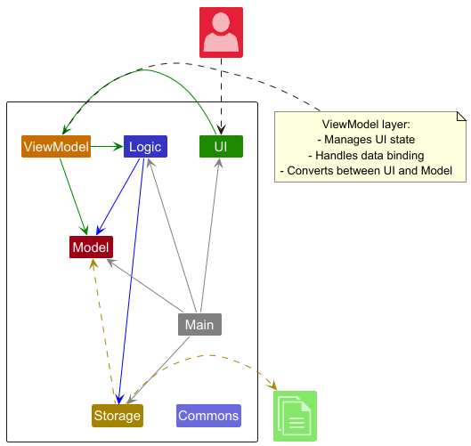
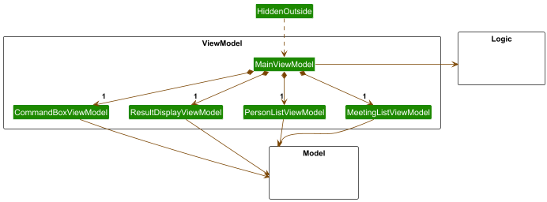
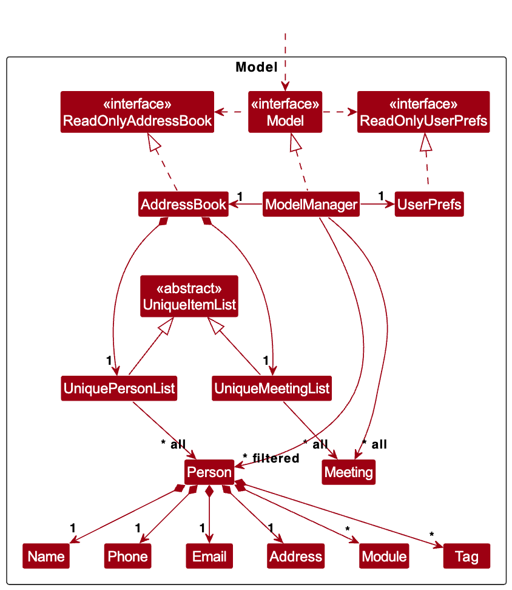
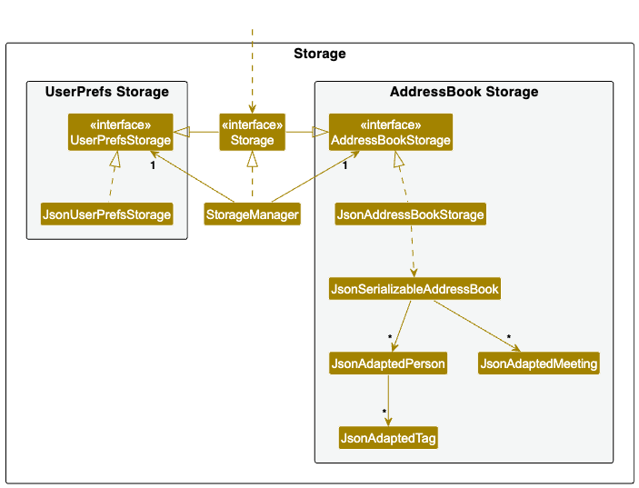

* Table of Contents
{:toc}

--------------------------------------------------------------------------------------------------------------------

## **Acknowledgements**

This project is based on the AddressBook-Level3 project created by the SE-EDU initiative.

TeamSync uses the following libraries: [AtlantaFX](#https://github.com/mkpaz/atlantafx) and [JavaFX](https://openjfx.io/) for UI design, [Jackson](https://github.com/FasterXML/jackson) to parse and generate JSON files, and [JUnit5](https://github.com/junit-team/junit5) for testing.

--------------------------------------------------------------------------------------------------------------------

## **Setting up, getting started**

Refer to the guide [_Setting up and getting started_](SettingUp.md).

--------------------------------------------------------------------------------------------------------------------

## **Design**

:bulb: **Tip:** The `.puml` files used to create diagrams in this document `docs/diagrams` folder. Refer to the [_PlantUML Tutorial_ at se-edu/guides](https://se-education.org/guides/tutorials/plantUml.html) to learn how to create and edit diagrams.

### Architecture

The ***Architecture Diagram*** given above explains the high-level design of the App.

Given below is a quick overview of main components and how they interact with each other.

**Main layers of the architecture**

**`Main`** (consisting of classes [`Main`](https://github.com/AY2425S2-CS2103T-F10-1/tp/blob/master/src/main/java/syncsquad/teamsync/Main.java) and [`MainApp`](https://github.com/AY2425S2-CS2103T-F10-1/tp/blob/master/src/main/java/syncsquad/teamsync/MainApp.java)) is in charge of the app launch and shut down.
* At app launch, it initializes the other layers in the correct sequence, and connects them up with each other.
* At shut down, it shuts down the other layers and invokes cleanup methods where necessary.

The bulk of the app's work is done by the following five layers:

* [**`View (FXML + Controller)`**](#view-component): The UI presentation of the App.
* [**`Viewmodel`**](#viewmodel-component): Manages the presentation logic and state of the UI.
* [**`Logic`**](#logic-component): The command executor.
* [**`Model`**](#model-component): Holds the data of the App in memory.
* [**`Storage`**](#storage-component): Reads data from, and writes data to, the hard disk.

[**`Commons`**](#common-classes) represents a collection of classes used by multiple other layers.

**How the architecture layers interact with each other**

The *Sequence Diagram* below shows how the layers interact with each other for the scenario where the user issues the command `delete 1`.

Each of the four main components (also shown in the diagram above),

* defines its *API* in an `interface` with the same name as the Component.
* implements its functionality using a concrete `{Component Name}Manager` class (which follows the corresponding API `interface` mentioned in the previous point.

For example, the `Logic` component defines its API in the `Logic.java` interface and implements its functionality using the `LogicManager.java` class which follows the `Logic` interface. Other components interact with a given component through its interface rather than the concrete class (reason: to prevent outside component's being coupled to the implementation of a component), as illustrated in the (partial) class diagram below.

The sections below give more details of each layer.

### View layer (FXML + Controller)

This layer represents the View layer of the MVVM (Model-View-ViewModel) architecture. It is responsible for:

* Rendering the user interface and handling user input
* Displaying data from the ViewModel
* Converting user actions into commands that are sent to the ViewModel
* Updating the UI in response to data changes in the ViewModel
* depends on some classes in the `Model` layer, as it displays `Person` object residing in the `Model`.

This separation of concerns allows the View to focus purely on presentation while delegating data handling to the ViewModel.

The View layer is initialized through the [`Ui`](https://github.com/AY2425S2-CS2103T-F10-1/tp/blob/master/src/main/java/syncsquad/teamsync/controller/Ui.java) interface, which serves as the entry point for UI initialization.

The UI consists of a `MainWindowController` that is made up of parts e.g. `CommandBoxController`, `PersonTreeViewController`, `MeetingTreeViewController`, `TimetableController` etc. All these, including the `MainWindowController`, inherit from the abstract `UiPart` class which captures the commonalities between classes that represent parts of the visible GUI.

The `Controller` classes are built using the JavaFX UI framework, where each UI component's layout is defined in corresponding `.fxml` files located in the `src/main/resources/view` folder. These controllers manage user interactions and communicate with the ViewModel layer. For instance, the [`MainWindowController`](https://github.com/AY2425S2-CS2103T-F10-1/tp/blob/master/src/main/java/syncsquad/teamsync/controller/MainWindowController.java) has its layout defined in [`MainWindow.fxml`](https://github.com/AY2425S2-CS2103T-F10-1/tp/blob/master/src/main/resources/view/MainWindow.fxml).

### ViewModel Layer

The ViewModel layer serves as the intermediary between the View and Model layers in the MVVM (Model-View-ViewModel) architecture. It is responsible for:

* Managing the presentation logic and state of the UI
* Converting data from the Model into a format suitable for display
* Handling user input and converting it into commands for the Logic layer
* Maintaining the state of UI components
* Providing data bindings for the View layer

The ViewModel layer consists of several specialized view models:

* **`MainViewModel`**: The central view model that coordinates all other view models and manages the overall application state.
* **`CommandBoxViewModel`**: Handles the command input functionality, managing the command text and execution.
* **`ResultDisplayViewModel`**: Manages the display of command results and feedback messages.
* **`PersonListViewModel`**: Handles the presentation logic for the person list, including filtering and sorting.
* **`MeetingListViewModel`**: Manages the display and state of meetings, including scheduling and conflicts.
* **`CurrentWeekViewModel`**: Handles the display of the current week's schedule and time-related information.

Each view model:
* Depends on the Model component for data
* Provides observable properties that the View can bind to
* Handles the conversion of Model data into displayable formats
* Manages the state of its corresponding UI component
* Communicates with the Logic layer for command execution

The ViewModel layer follows these design principles:
1. **Separation of Concerns**: Each view model is responsible for a specific aspect of the UI
2. **Data Binding**: Uses JavaFX's property system for automatic UI updates
3. **Dependency Management**: Maintains clear dependencies on Model and Logic layers
4. **State Management**: Handles UI state independently of the View layer

### Logic layer

**API** : [`Logic.java`](https://github.com/AY2425S2-CS2103T-F10-1/tp/blob/master/src/main/java/syncsquad/teamsync/logic/Logic.java)

Here's a (partial) class diagram of the `Logic` layer:

The Logic layer is responsible for:

* Processing user commands and executing them
* Managing the command parsing and execution flow
* Coordinating between the ViewModel and Model layers
* Handling command validation and error checking
* Providing feedback on command execution results

The Logic layer consists of several key components:

* **`LogicManager`**: The main implementation of the `Logic` interface that orchestrates command execution
* **`Messages`**: Contains common message strings used throughout the application
* **Command Parsers**: Located in the `parser` package, responsible for parsing user input into executable commands
* **Commands**: Located in the `commands` package, implementing the actual command logic

How the `Logic` layer works:

1. When a command is received from the ViewModel layer, the `LogicManager` processes it through the following steps:
   * The command string is passed to the appropriate parser in the `parser` package
   * The parser validates the command format and parameters
   * A corresponding `Command` object is created
   * The command is executed, interacting with the Model layer as needed
   * A `CommandResult` is returned to the ViewModel layer

2. The command execution flow:
   * Commands can modify the Model's state (e.g., adding/removing persons, meetings)
   * Commands can query the Model for information
   * Commands can trigger UI updates through the ViewModel
   * All command results include feedback messages for the user

3. Error handling:
   * Invalid commands are caught and reported with helpful error messages
   * Command-specific validation ensures data integrity
   * Exceptions are properly handled and converted to user-friendly messages

The sequence diagram below illustrates the interactions within the `Logic` layer, taking `execute("delete 1")` API call as an example.

:information_source: **Note:** The lifeline for `DeleteCommandParser` should end at the destroy marker (X) but due to a limitation of PlantUML, the lifeline continues till the end of diagram.

Here are the other classes in `Logic` (omitted from the class diagram above) that are used for parsing a user command:

How the parsing works:
* When called upon to parse a user command, the `AddressBookParser` class creates an `XYZCommandParser` (`XYZ` is a placeholder for the specific command name e.g., `AddCommandParser`) which uses the other classes shown above to parse the user command and create a `XYZCommand` object (e.g., `AddCommand`) which the `AddressBookParser` returns back as a `Command` object.
* All `XYZCommandParser` classes (e.g., `AddCommandParser`, `DeleteCommandParser`, ...) inherit from the `Parser` interface so that they can be treated similarly where possible e.g, during testing.

### Model layer
**API** : [`Model.java`](https://github.com/AY2425S2-CS2103T-F10-1/tp/blob/master/src/main/java/syncsquad/teamsync/model/Model.java)

The Model layer is responsible for:

* Managing the application's data and business logic
* Maintaining data integrity and consistency
* Providing data access and manipulation methods
* Supporting data observation through observable properties
* Managing user preferences and settings

The Model layer consists of several key components:

* **`ModelManager`**: The main implementation of the `Model` interface that manages all data operations
* **`AddressBook`**: The central data structure that holds all application data
* **`UniqueItemList`**: A generic list implementation that ensures uniqueness of items
* **`UserPrefs`**: Manages user preferences and settings

The Model layer is organized into several packages:

* **`person`**: Contains classes related to person management
* **`meeting`**: Contains classes related to meeting management
* **`module`**: Contains classes related to module management
* **`tag`**: Contains classes related to tag management
* **`util`**: Contains utility classes used across the model

Key features of the Model layer:

1. **Data Management**:
   * Stores and manages all application data (persons, meetings, modules, etc.) in storage layer
   * Ensures data consistency and integrity
   * Provides methods for data manipulation and retrieval
   * Maintains relationships between different data entities

2. **Observable Properties**:
   * Exposes data through observable lists for UI binding
   * Notifies observers of data changes
   * Supports filtered views of data
   * Enables real-time UI updates

3. **Data Access**:
   * Provides read-only interfaces for data access
   * Implements data validation and constraints
   * Supports data filtering and searching
   * Manages data relationships and dependencies

4. **User Preferences**:
   * Stores user-specific settings in storage layer
   * Provides read-only access to preferences
   * Supports preference modification
   * Persists preferences across sessions

The Model layer follows these design principles:
1. **Encapsulation**: Data access is controlled through well-defined interfaces
2. **Immutability**: Data objects are immutable to ensure consistency
3. **Dependency Inversion**: Higher-level components depend on abstractions
4. **Single Responsibility**: Each class has a specific, well-defined purpose

:information_source: **Note:** The Model layer is designed to be only dependent on storage layer, allowing it to be tested and modified without affecting the rest of the application.

### Storage layer

**API** : [`Storage.java`](https://github.com/AY2425S2-CS2103T-F10-1/tp/blob/master/src/main/java/syncsquad/teamsync/storage/Storage.java)

The Storage layer is responsible for:

* Persisting application data to and from the file system
* Managing data serialization and deserialization
* Handling data format conversion
* Providing data backup and recovery capabilities
* Managing user preferences storage

The Storage layer consists of several key components:

* **`StorageManager`**: The main implementation of the `Storage` interface that coordinates all storage operations
* **`JsonAddressBookStorage`**: Handles the storage of address book data in JSON format
* **`JsonUserPrefsStorage`**: Manages the storage of user preferences in JSON format
* **`JsonSerializableAddressBook`**: Represents the serializable version of the address book
* **`JsonAdaptedPerson`**: Handles the conversion between Person objects and JSON
* **`JsonAdaptedMeeting`**: Handles the conversion between Meeting objects and JSON
* **`JsonAdaptedModule`**: Handles the conversion between Module objects and JSON
* **`JsonAdaptedTag`**: Handles the conversion between Tag objects and JSON

Key features of the Storage layer:

1. **Data Persistence**:
   * Saves application data to JSON files
   * Loads data from JSON files
   * Maintains data integrity during save/load operations
   * Handles file I/O operations safely

2. **Data Conversion**:
   * Converts between Java objects and JSON format
   * Handles complex object relationships
   * Maintains data consistency during conversion
   * Validates data during deserialization

3. **User Preferences**:
   * Stores user preferences in a separate file
   * Loads preferences on application startup
   * Updates preferences when modified
   * Maintains preference consistency

4. **Error Handling**:
   * Handles file system errors gracefully
   * Provides meaningful error messages
   * Maintains data integrity during errors
   * Supports data recovery when possible

:information_source: **Note:** The Storage layer is designed to be independent of the Model layer's implementation details, allowing for changes in the data model without affecting storage operations.

### Common classes

Classes used by multiple components are organized in the `syncsquad.teamsync.commons` package, which is divided into several subpackages:

1. **`core`**:
   * Contains fundamental classes that define the core behavior of the application
   * Provides base classes and interfaces used across different layers
   * Defines common data structures and utilities

2. **`exceptions`**:
   * Contains custom exception classes used throughout the application
   * Provides specialized exception handling for different scenarios
   * Includes error messages and recovery suggestions

3. **`util`**:
   * Contains utility classes and helper methods
   * Provides common functionality used across different components
   * Includes string manipulation, date handling, and other utility functions

:information_source: **Note:** The Common classes are designed to be independent of specific components, allowing them to be used across the entire application without creating unnecessary dependencies.

--------------------------------------------------------------------------------------------------------------------

## **Implementation**

This section describes some noteworthy details on how certain features are implemented.

### \[Proposed\] Undo/redo feature

#### Proposed Implementation

The proposed undo/redo mechanism is facilitated by `VersionedAddressBook`. It extends `AddressBook` with an undo/redo history, stored internally as an `addressBookStateList` and `currentStatePointer`. Additionally, it implements the following operations:

* `VersionedAddressBook#commit()` — Saves the current address book state in its history.
* `VersionedAddressBook#undo()` — Restores the previous address book state from its history.
* `VersionedAddressBook#redo()` — Restores a previously undone address book state from its history.

These operations are exposed in the `Model` interface as `Model#commitAddressBook()`, `Model#undoAddressBook()` and `Model#redoAddressBook()` respectively.

Given below is an example usage scenario and how the undo/redo mechanism behaves at each step.

Step 1. The user launches the application for the first time. The `VersionedAddressBook` will be initialized with the initial address book state, and the `currentStatePointer` pointing to that single address book state.

Step 2. The user executes `delete 5` command to delete the 5th person in the address book. The `delete` command calls `Model#commitAddressBook()`, causing the modified state of the address book after the `delete 5` command executes to be saved in the `addressBookStateList`, and the `currentStatePointer` is shifted to the newly inserted address book state.

Step 3. The user executes `add n/David …​` to add a new person. The `add` command also calls `Model#commitAddressBook()`, causing another modified address book state to be saved into the `addressBookStateList`.

:information_source: **Note:** If a command fails its execution, it will not call `Model#commitAddressBook()`, so the address book state will not be saved into the `addressBookStateList`.

Step 4. The user now decides that adding the person was a mistake, and decides to undo that action by executing the `undo` command. The `undo` command will call `Model#undoAddressBook()`, which will shift the `currentStatePointer` once to the left, pointing it to the previous address book state, and restores the address book to that state.

:information_source: **Note:** If the `currentStatePointer` is at index 0, pointing to the initial AddressBook state, then there are no previous AddressBook states to restore. The `undo` command uses `Model#canUndoAddressBook()` to check if this is the case. If so, it will return an error to the user rather
than attempting to perform the undo.

The following sequence diagram shows how an undo operation goes through the `Logic` component:

:information_source: **Note:** The lifeline for `UndoCommand` should end at the destroy marker (X) but due to a limitation of PlantUML, the lifeline reaches the end of diagram.

Similarly, how an undo operation goes through the `Model` component is shown below:

The `redo` command does the opposite — it calls `Model#redoAddressBook()`, which shifts the `currentStatePointer` once to the right, pointing to the previously undone state, and restores the address book to that state.

:information_source: **Note:** If the `currentStatePointer` is at index `addressBookStateList.size() - 1`, pointing to the latest address book state, then there are no undone AddressBook states to restore. The `redo` command uses `Model#canRedoAddressBook()` to check if this is the case. If so, it will return an error to the user rather than attempting to perform the redo.

Step 5. The user then decides to execute the command `list`. Commands that do not modify the address book, such as `list`, will usually not call `Model#commitAddressBook()`, `Model#undoAddressBook()` or `Model#redoAddressBook()`. Thus, the `addressBookStateList` remains unchanged.

Step 6. The user executes `clear`, which calls `Model#commitAddressBook()`. Since the `currentStatePointer` is not pointing at the end of the `addressBookStateList`, all address book states after the `currentStatePointer` will be purged. Reason: It no longer makes sense to redo the `add n/David …​` command. This is the behavior that most modern desktop applications follow.

The following activity diagram summarizes what happens when a user executes a new command:

_#### Design considerations:

**Aspect: How undo & redo executes:**

* **Alternative 1 (current choice):** Saves the entire address book.
  * Pros: Easy to implement.
  * Cons: May have performance issues in terms of memory usage.

* **Alternative 2:** Individual command knows how to undo/redo by
  itself.
  * Pros: Will use less memory (e.g. for `delete`, just save the person being deleted).
  * Cons: We must ensure that the implementation of each individual command are correct.

_{more aspects and alternatives to be added}_

### \[Proposed\] Data archiving

_{Explain here how the data archiving feature will be implemented}_

--------------------------------------------------------------------------------------------------------------------

## **Documentation, logging, testing, configuration, dev-ops**

* [Documentation guide](Documentation.md)
* [Testing guide](Testing.md)
* [Logging guide](Logging.md)
* [Configuration guide](Configuration.md)
* [DevOps guide](DevOps.md)

--------------------------------------------------------------------------------------------------------------------

## **Appendix: Requirements**

### Product scope

**Target user profile**:

* is an NUS student
* is taking multiple modules with group projects
* wants to be able to schedule meetings without any timetable clashes
* wants to keep track of tasks for each group project
* prefers typing to mouse interactions
* is comfortable with desktop apps and command-line interfaces (CLI)

**Value proposition**: TeamSync allows NUS students to efficiently manage group projects. TeamSync integrates contact management with availability tracking based on timetables, allowing for easy scheduling of meetings and tracking of tasks.

### User stories

Priorities: High (must have) - `* * *`, Medium (nice to have) - `* *`, Low (unlikely to have) - `*`

| Priority | As a …​                 | I can …​                           | So that I can…​                                                                 |
|---------|-------------------------|------------------------------------|---------------------------------------------------------------------------------|
| `* * *` | First-time user         | See usage instructions             | Refer to instructions when I forget how to use TeamSync                         |
| `* * *` | First-time user         | See sample data                    | Understand how the data is visualised on TeamSync                               |
| `* * *` | First-time user         | Delete all data                    | Remove all sample data to start using TeamSync                                  |
| `* * *` | User                    | Add a new contact                  |                                                                                 |
| `* * *` | User                    | Delete a contact                   | Remove contacts that I no longer need                                           |
| `* * *` | User                    | Edit a contact                     | Fix mistakes or update contact details                                          |
| `* * *` | User                    | Find a contact by name             | Locate details of persons without having to go through the entire list          |
| `* * *` | User                    | Add a module to a contact          | Keep track of which modules a person is taking and his availability             |
| `* *`   | User                    | Edit a module for a contact        | Fix mistakes or update module details                                           |
| `* * *` | User                    | Delete a module for a contact      | Keep the module list up to date whenever a module ends                          |
| `*`     | User                    | Filter contacts by module          | Find who is taking the same module without having to go through the entire list |
| `* * *` | User                    | View a contact's timetable         | Easily visualise the contact's availability                                     |
| `* *`   | Group member            | Create a group                     | Easily find the contact details of my group members                             |
| `* *`   | Group member            | Delete a group                     | Delete groups when a group project is over                                      |
| `* *`   | Group member            | Add a contact to a group           | Keep track of my group members                                                  |
| `* *`   | Group member            | Remove a contact from a group      | Ensure that the group list stays updated whenever a group member leaves         |
| `* *`   | Group member            | View all group members' timetables | Easily find common meeting times                                                |
| `* * *` | Group member            | Create a meeting                   | Plan for a group meeting                                                        |
| `* *`   | Group member            | Edit a meeting                     | Fix mistakes or update details of a meeting                                     |
| `* * *` | Group member            | Delete a meeting                   | Remove old or cancelled meetings                                                |
| `* *`   | Group member            | View upcoming meetings             | Be aware of and attend the meeting                                              |
| `* *`   | Group member            | Create a task                      | Track tasks effectively                                                         |
| `*`     | Group member            | Edit a task                        | Fix mistakes or update task details                                             |
| `* *`   | Group member            | Delete a task                      | Delete old or cancelled tasks                                                   |
| `*`     | Group member            | Set task priorities                | Know which tasks to focus on first                                              |
| `*`     | Group member            | Set task responsibilities          | Know who is responsible for completing a task                                   |
| `* *`   | Group member            | Update task status                 | Keep track of whether a task has been completed                                 |
| `* *`   | Group member            | View completed tasks               | Keep track of what has been accomplished                                        |
| `* *`   | Group member            | View uncompleted tasks             | Keep track of what is to be done                                                |
| `*`     | Group member            | View upcoming deadlines            | Keep track of tasks that are due soon                                           |

### Use cases

#### Use case: UC 01 - Add contact
**System**: TeamSync

**Actor**: User

**Preconditions**: User has the details of the person being added

**MSS**

1. User chooses to add a contact
2. User enters the contact details
3. TeamSync adds the contact and displays a success message 
4. TeamSync updates display to reflect the added contact

    Use case ends

**Extensions**

2a. TeamSync detects an error in the entered details
* 2a1. TeamSync displays an error message
    
    Use case ends

#### Use case: UC 02 - Delete contact
**System**: TeamSync

**Actor**: User

**MSS**

1. User chooses a contact to delete
2. TeamSync deletes the contact and displays a success message
3. TeamSync updates display to reflect the deleted contact

   Use case ends

**Extensions**

1a. User selects an invalid contact to delete
* 1a1. TeamSync displays an error message

  Use case ends

#### Use case: UC 03 - Edit contact
**System**: TeamSync

**Actor**: User

**Preconditions**: User has the new details of the contact being updated

**MSS**

1. User chooses a contact to edit
2. User enters the updated contact details
2. TeamSync updates the contact and displays a success message
3. TeamSync updates display to reflect the deleted contact

   Use case ends

**Extensions**

1a. User selects an invalid contact to update
* 1a1. TeamSync displays an error message

  Use case ends

2a. TeamSync detects an error in the entered details
* 2a1. TeamSync displays an error message

  Use case ends

#### Use case: UC 04 - List all contacts
**System**: TeamSync

**Actor**: User

**MSS**

1. User chooses to display all contacts
2. TeamSync displays all contacts

   Use case ends

#### Use case: UC 05 - Find contact by name
**System**: TeamSync

**Actor**: User

**MSS**

1. User enters the name of the contact
2. TeamSync displays contacts that match the name entered

   Use case ends

**Extensions**

2a. No contact matches the name entered
* 2a1. TeamSync displays a message that no contacts matching the name is found

  Use case ends

#### Use case: UC 06 - Create a group
**System**: TeamSync

**Actor**: User

**MSS**

1. User chooses to create a group
2. User enters the name of the group
3. TeamSync displays a message that a group has been created

   Use case ends

**Extensions**

2a. TeamSync detects that a group with the same name already exists
* 2a1. TeamSync displays an error message

  Use case ends

#### Use case: UC 07 - Add contact to a group
**System**: TeamSync

**Actor**: User

**Preconditions**: User has already added the contact to TeamSync

**MSS**

1. User chooses to add a contact to a group
2. User <u>finds the contact by name (UC 05)</u>
3. User chooses the contact to add
4. User chooses a group to add the contact to
5. TeamSync displays a message that the contact has been added to the group successfully

   Use case ends

**Extensions**

1a. TeamSync detects that no groups exist
* 1a1. TeamSync displays an error message

  Use case ends

2a. TeamSync detects that no contacts match the name provided
* 2a1. TeamSync requests for the correct name

  Step 2a1 is repeated until a matching contact has been found

  Use case resumes from step 3

4a. TeamSync detects that an invalid group has been chosen
* 4a1. TeamSync requests for the correct group

  Step 4a1 is repeated until a valid group has been found

  Use case ends

#### Use case: UC 08 - Remove contact from a group
**System**: TeamSync

**Actor**: User

**Preconditions**: User has added the contact to a group

**MSS**

1. User chooses to remove a contact from a group
2. User chooses a group to remove a contact from
3. User chooses which contact among the group to remove
4. TeamSync displays a message that the contact has been removed from the group successfully

   Use case ends

**Extensions**

1a. TeamSync detects that no groups exist
* 1a1. TeamSync displays an error message

  Use case ends

2a. TeamSync detects that an invalid group has been chosen
* 2a1. TeamSync requests for the correct group

  Step 2a1 is repeated until a valid group has been found

  Use case resumes from step 3

3a. TeamSync detects that an invalid contact has been chosen
* 3a1. TeamSync requests for the correct contact

  Step 3a1 is repeated until a valid contact has been found

  Use case resumes from step 4

#### Use case: UC 09 - Remove contact from a group
**System**: TeamSync

**Actor**: User

**Preconditions**: User has added the contact to a group

**MSS**

1. User chooses to remove a contact from a group
2. User chooses a group to remove a contact from
3. User chooses which contact among the group to remove
4. TeamSync displays a message that the contact has been removed from the group successfully

   Use case ends

**Extensions**

1a. TeamSync detects that no groups exist
* 1a1. TeamSync displays an error message

  Use case ends

2a. TeamSync detects that an invalid group has been chosen
* 2a1. TeamSync requests for the correct group

  Step 2a1 is repeated until a valid group has been found

  Use case resumes from step 3

3a. TeamSync detects that an invalid contact has been chosen
* 3a1. TeamSync requests for the correct contact

  Step 3a1 is repeated until a valid contact has been found

  Use case resumes from step 4

#### Use case: UC 10 - Create a group meeting
**System**: TeamSync

**Actor**: User

**Preconditions**: User has created the group will have a meeting

**MSS**

1. User chooses to create a group meeting
2. User chooses a group that will have the meeting
3. TeamSync displays a message that the group has been chosen successfully
4. TeamSync requests for the meeting details
5. User enters the meeting details
6. TeamSync displays a message that the meeting has been created successfully

   Use case ends

**Extensions**

1a. TeamSync detects that no groups exist
* 1a1. TeamSync displays an error message

  Use case ends

2a. TeamSync detects that an invalid group has been chosen
* 2a1. TeamSync requests for the correct group

  Step 2a1 is repeated until a valid group has been found

  Use case resumes from step 3

3a. TeamSync detects an error in the entered meeting details
* 3a1. TeamSync displays an error message

  Use case ends

5b. TeamSync detects the entered meeting overlaps with another meeting from either the same or a different group
* 5b1. TeamSync displays a warning with the meeting details of the overlapping meeting
* 5b2. TeamSync requests for confirmation to create the meeting
  Use case ends

#### Use case: UC 11 - Delete a group meeting
**System**: TeamSync

**Actor**: User

**Preconditions**: User has created a group meeting

**MSS**

1. User chooses to delete a group meeting
2. TeamSync displays a list of groups that currently have a meeting scheduled
3. User chooses a group to delete a meeting from
4. TeamSync displays a message that the group has been chosen successfully
5. TeamSync displays a list of meetings scheduled for that group
6. User chooses a meeting to delete
7. TeamSync displays a message that the meeting has been deleted successfully

   Use case ends

**Extensions**

1a. TeamSync detects that no groups exist
* 1a1. TeamSync displays an error message

  Use case ends

3a. TeamSync detects that an invalid group has been chosen
* 3a1. TeamSync requests for the correct group

  Step 3a1 is repeated until a valid group has been found

  Use case resumes from step 4

6a. TeamSync detects that an invalid meeting has been chosen
* 6a1. TeamSync requests for the correct meeting

  Step 6a1 is repeated until a valid meeting has been found
  
  Use case resumes from step 7

*{More to be added}*

### Non-Functional Requirements

1. TeamSync should work on any _mainstream OS_ as long as it has Java `17` or above installed.
2. TeamSync should be able to store up to 1000 contacts and 100 groups without a noticeable sluggishness in performance for typical usage.
3. A user with above average typing speed for regular English text (i.e. not code, not system admin commands) should be able to accomplish most of the tasks faster using commands than using the mouse.
4. TeamSync should respond to commands within 1 second under regular operating conditions
5. TeamSync should work without requiring an installer.
6. TeamSync should not depend on a remote server.
7. TeamSync's GUI should not cause any resolution-related inconveniences to the user for
   * standard screen resolutions 1920x1080 and higher, and 
   * for screen scales 100% and 125%.
8. TeamSync's GUI should allow for all functions to be used even if the user experience is not optimal for
    * resolutions 1280x720 and higher, and
    * for screen scales 150%. 
9. TeamSync's data should be stored locally in a human editable text file.
10. TeamSync should be packaged into a single JAR file.
11. TeamSync should work on Windows, Linux, and OS-X platforms.
12. TeamSync should not be larger than 100MB.
13. Documentation should not exceed 15MB per file.
14. The developer guide and user guide should be PDF-friendly.

*{More to be added}*

### Glossary

* **CLI**: Command Line Interface
* **GUI**: Graphical User Interface
* **Invalid group**: A group the user specified when prompted by TeamSync which does not exist
* **Invalid contact**: A contact the user specified when prompted by TeamSync which does not exist
* **Invalid meeting**: A meeting the user specified when prompted by TeamSync which does not exist

--------------------------------------------------------------------------------------------------------------------

## **Appendix: Instructions for manual testing**

Given below are instructions to test the app manually.

:information_source: **Note:** These instructions only provide a starting point for testers to work on;
testers are expected to do more *exploratory* testing.

### Launch and shutdown

1. Initial launch

   1. Download the jar file and copy into an empty folder

   1. Double-click the jar file
   
      **Expected**: Shows the GUI with a set of sample contacts and meetings.

1. Saving window preferences

   1. Resize the window to your preferred size. Move the window to a different location. Close the window.

   1. Re-launch the app by double-clicking the jar file.
   
      **Expected**: The most recent window size and location is retained.

### Adding a teammate

1. Adding a teammate

1. Prerequisites: No teammates with the email `johndoe@example.com` is in TeamSync.

1. Test case: `person add -n John Doe -p 98765432 -e johndoe@example.com -a John street, block 123, #01-01` 
   Expected: Teammate `John Doe` is added to TeamSync with all the correct details.

1. Test case: `person add -n Johnny Doe -p 12345678 -e johndoe@example.com -a Johnny street, block 321, #02-02` 
   Expected: If run after the previous test case, an error is displayed indicating that a duplicate contact is being added.

### Editing a teammate

1. Prerequisites: List all teammates using the `person list` command. Multiple teammates in the list.

1. Test case: `person edit 1 -n Jane Doe` 
   Expected: First teammate in the list has the name changed to `Jane Doe`.

1. Test case: `person edit 1 -m` 
   Expected: First teammate in the list has all of their modules removed.

### Deleting a teammate

1. Deleting a teammate while all teammates are being shown

   1. Prerequisites: List all teammates using the `person list` command. Multiple teammates in the list.

   1. Test case: `person delete 1` 
      Expected: First contact is deleted from the list. Details of the deleted contact shown in the status message. Timestamp in the status bar is updated.

   1. Test case: `person delete 0` 
      Expected: No teammate is deleted. Error details shown in the status message. Status bar remains the same.

   1. Other incorrect delete commands to try: `person delete`, `person delete x`, `...` (where x is larger than the list size) 
      Expected: Similar to previous.

### Adding a module

1. Prerequisites: List all teammates using the `person list` command. Multiple teammates in the list.

1. Test case: `mod add 1 CS2101 Thu 12:00 15:00` 
   Expected: Adds the module CS2101 with the correct day, start and end time to the first teammate in the list.

### Deleting a module

1. Prerequisites: First teammate in the list has the module `CS2101`.

1. Test case: `mod delete 1 CS2101` 
   Expected: Deletes the module CS2101 from the first teammate in the list.

### Adding a meeting

1. Prerequisites: No meetings in the list overlap with the time period 27-03-2025 12:00 to 15:00.

1. Test case: `meeting add 27-03-2025 12:00 15:00` 
   Expected: Adds a meeting on 27-03-2025 from 12:00 to 15:00 to TeamSync.

1. Test case: `meeting add 27-03-2025 14:00 16:00` 
   Expected: If run after the previous test case, an error is displayed indicating that an overlapping meeting is being added.

### Deleting a meeting

1. Prerequisites: Multiple meetings in the list.

1. Test case: `meeting delete 1` 
   Expected: First meeting is deleted from the list.

1. Test case: `person delete 0` 
   Expected: No meeting is deleted. Error details shown in the status message.

### Changing week displayed

1. Test case: `showdate 22-04-2025` 
   Expected: Shows the timetable from 21-04-2025 (Mon) to 27-04-2025 (Sun)