## About TeamSync

TeamSync is a contact management app designed to streamline group project management, **built by National University of Singapore (NUS) students, for NUS students**.

Designed with simplicity and efficiency in mind, TeamSync makes it easy to add teammates' contact details, schedule meetings, and stay organized. It combines the intuitive visuals of a Graphical User Interface (GUI) with the speed and precision of a Command Line Interface (CLI). Built-in validation checks help prevent errors, ensuring a seamless experience.

This Developer Guide documents the internal design and implementation of TeamSync. This guide contains information on the architecture of our app, testing and logging procedures.

---

- Table of Contents
  {:toc}

---

## **Acknowledgements**

TeamSync is built on [AddressBook Level-3](https://se-education.org/addressbook-level3/), for the module CS2103T under the National University of Singapore.

Software Dependencies

| Dependency                                      | Use              |
| ----------------------------------------------- | ---------------- |
| [Gradle](https://gradle.org/)                   | Build Automation |
| [JavaFX](https://openjfx.io/)                   | GUI              |
| [Jackson](https://github.com/FasterXML/jackson) | JSON Parser      |
| [JUnit5](https://github.com/junit-team/junit5)  | Testing          |
| [AtlantaFX](https://github.com/mkpaz/atlantafx) | GUI CSS          |
| [Ikonli](https://github.com/kordamp/ikonli)     | Icon Pack        |

Documentation Dependencies

| Dependency                                | Use            |
| ----------------------------------------- | -------------- |
| [Jekyll](https://jekyllrb.com/)           | Site Rendering |
| [PlantUML](https://plantuml.com/)         | UML Diagrams   |
| [GitHub Pages](https://pages.github.com/) | Site Hosting   |

Miscellaneous

| Dependency | Use |
| --------- | -------- |
| [GitHub](https://github.com/) | Version Control |

---

## **Setting up, getting started**

Refer to the guide [_Setting up and getting started_](SettingUp.md).

---

## **Design**

### Architecture

The **_Architecture Diagram_** given above explains the high-level design of the App.

Given below is a quick overview of main components and how they interact with each other.

**Main layers of the architecture**

**`Main`** (consisting of classes [`Main`](https://github.com/AY2425S2-CS2103T-F10-1/tp/blob/master/src/main/java/syncsquad/teamsync/Main.java) and [`MainApp`](https://github.com/AY2425S2-CS2103T-F10-1/tp/blob/master/src/main/java/syncsquad/teamsync/MainApp.java)) is responsible for the app launch and shutdown.

- At app launch, it initializes the other layers in the correct sequence, and connects them up with each other.
- At shut down, it shuts down the other layers and invokes cleanup methods where necessary.

The main architecture can be separated into the following 5 layers:

- [**`View (FXML + Controller)`**](#view-component): The UI presentation of the app.
- [**`Viewmodel`**](#viewmodel-component): Manages the presentation logic and state of the UI.
- [**`Logic`**](#logic-component): The command executor.
- [**`Model`**](#model-component): Holds the data of the app in memory.
- [**`Storage`**](#storage-component): Reads data from, and writes data to, the hard disk.

[**`Commons`**](#common-classes) represents a collection of classes used by multiple layers.

**How the architecture layers interact with each other**

The _Sequence Diagram_ below shows how the layers interact with each other for the scenario where the user issues the command `delete 1`.

Each of the four main components (also shown in the diagram above),

- defines its _API_ in an `interface` with the same name as the Component.
- implements its functionality using a concrete `{Component Name}Manager` class (which follows the corresponding API `interface` mentioned in the previous point).

For example, the `Logic` component defines its API in the `Logic.java` interface and implements its functionality using the `LogicManager.java` class which follows the `Logic` interface. Other components interact with a given component through its interface rather than the concrete class (reason: to prevent outside component's being coupled to the implementation of a component), as illustrated in the (partial) class diagram below.

The sections below give more details of each layer.

### View layer (FXML + Controller)

This layer represents the View layer of the MVVM (Model-View-ViewModel) architecture. It is responsible for:

- Rendering the user interface and handling user input
- Displaying data from the ViewModel
- Converting user actions into commands that are sent to the ViewModel
- Updating the UI in response to data changes in the ViewModel
- depends on some classes in the `Model` layer, as it displays `Person` object residing in the `Model`.

This separation of concerns allows the View to focus purely on presentation while delegating data handling to the ViewModel.

The View layer is initialized through the [`Ui`](https://github.com/AY2425S2-CS2103T-F10-1/tp/blob/master/src/main/java/syncsquad/teamsync/controller/Ui.java) interface, which serves as the entry point for UI initialization.

The UI consists of a `MainWindowController` that is made up of parts e.g. `CommandBoxController`, `PersonTreeViewController`, `MeetingTreeViewController`, `TimetableController` etc. All these, including the `MainWindowController`, inherit from the abstract `UiPart` class which captures the commonalities between classes that represent parts of the visible GUI.

The `Controller` classes are built using the JavaFX UI framework, where each UI component's layout is defined in corresponding `.fxml` files located in the `src/main/resources/view` folder. These controllers manage user interactions and communicate with the ViewModel layer. For instance, the [`MainWindowController`](https://github.com/AY2425S2-CS2103T-F10-1/tp/blob/master/src/main/java/syncsquad/teamsync/controller/MainWindowController.java) has its layout defined in [`MainWindow.fxml`](https://github.com/AY2425S2-CS2103T-F10-1/tp/blob/master/src/main/resources/view/MainWindow.fxml).

We make use of AtlantaFX Styles to style in-line in controller files as much as possible. FXML files are used to embed controller logic and are intended to be thin UI wireframes, as opposed to fully fledged interfaces.

### ViewModel Layer

The ViewModel layer serves as the intermediary between the View and Model layers in the MVVM (Model-View-ViewModel) architecture. It is responsible for:

- Managing the presentation logic and state of the UI
- Converting data from the Model into a format suitable for display
- Handling user input and converting it into commands for the Logic layer
- Maintaining the state of UI components
- Providing data bindings for the View layer

The ViewModel layer consists of several specialized view models:

- **`MainViewModel`**: The central view model that coordinates all other view models and manages the overall application state.
- **`CommandBoxViewModel`**: Handles the command input functionality, managing the command text and execution.
- **`ResultDisplayViewModel`**: Manages the display of command results and feedback messages.
- **`PersonListViewModel`**: Handles the presentation logic for the person list, including filtering and sorting.
- **`MeetingListViewModel`**: Manages the display and state of meetings, including scheduling and conflicts.
- **`CurrentWeekViewModel`**: Handles the display of the current week's schedule and time-related information.

Each view model:

- Depends on the Model component for data
- Provides observable properties that the View can bind to
- Handles the conversion of Model data into displayable formats
- Manages the state of its corresponding UI component
- Communicates with the Logic layer for command execution

The ViewModel layer follows these design principles:

1. **Separation of Concerns**: Each view model is responsible for a specific aspect of the UI
2. **Data Binding**: Uses JavaFX's property system for automatic UI updates
3. **Dependency Management**: Maintains clear dependencies on Model and Logic layers
4. **State Management**: Handles UI state independently of the View layer

### Logic layer

**API** : [`Logic.java`](https://github.com/AY2425S2-CS2103T-F10-1/tp/blob/master/src/main/java/syncsquad/teamsync/logic/Logic.java)

Here's a (partial) class diagram of the `Logic` layer:

The Logic layer is responsible for:

- Processing user commands and executing them
- Managing the command parsing and execution flow
- Coordinating between the ViewModel and Model layers
- Handling command validation and error checking
- Providing feedback on command execution results

The Logic layer consists of several key components:

- **`LogicManager`**: The main implementation of the `Logic` interface that orchestrates command execution
- **`Messages`**: Contains common message strings used throughout the application
- **Command Parsers**: Located in the `parser` package, responsible for parsing user input into executable commands
- **Commands**: Located in the `commands` package, implementing the actual command logic

How the `Logic` layer works:

1. When a command is received from the ViewModel layer, the `LogicManager` processes it through the following steps:

   - The command string is passed to the appropriate parser in the `parser` package
   - The parser validates the command format and parameters
   - A corresponding `Command` object is created
   - The command is executed, interacting with the Model layer as needed
   - A `CommandResult` is returned to the ViewModel layer

2. The command execution flow:

   - Commands can modify the Model's state (e.g., adding/removing persons, meetings)
   - Commands can query the Model for information
   - Commands can trigger UI updates through the ViewModel
   - All command results include feedback messages for the user

3. Error handling:
   - Invalid commands are caught and reported with helpful error messages
   - Command-specific validation ensures data integrity
   - Exceptions are properly handled and converted to user-friendly messages

The sequence diagram below illustrates the interactions within the `Logic` layer, taking `execute("delete 1")` API call as an example.

:information_source: **Note:** The lifeline for `DeleteCommandParser` should end at the destroy marker (X) but due to a limitation of PlantUML, the lifeline continues till the end of diagram.

Here are the other classes in `Logic` (omitted from the class diagram above) that are used for parsing a user command:

How the parsing works:

- When called upon to parse a user command, the `AddressBookParser` class creates an `XYZCommandParser` (`XYZ` is a placeholder for the specific command name e.g., `AddCommandParser`) which uses the other classes shown above to parse the user command and create a `XYZCommand` object (e.g., `AddCommand`) which the `AddressBookParser` returns back as a `Command` object.
- All `XYZCommandParser` classes (e.g., `AddCommandParser`, `DeleteCommandParser`, ...) inherit from the `Parser` interface so that they can be treated similarly where possible e.g, during testing.

### Model layer

**API** : [`Model.java`](https://github.com/AY2425S2-CS2103T-F10-1/tp/blob/master/src/main/java/syncsquad/teamsync/model/Model.java)

The Model layer is responsible for:

- Managing the application's data and business logic
- Maintaining data integrity and consistency
- Providing data access and manipulation methods
- Supporting data observation through observable properties
- Managing user preferences and settings

The Model layer consists of several key components:

- **`ModelManager`**: The main implementation of the `Model` interface that manages all data operations
- **`AddressBook`**: The central data structure that holds all application data
- **`UniqueItemList`**: A generic list implementation that ensures uniqueness of items
- **`UserPrefs`**: Manages user preferences and settings

The Model layer is organized into several packages:

- **`person`**: Contains classes related to person management
- **`meeting`**: Contains classes related to meeting management
- **`module`**: Contains classes related to module management
- **`tag`**: Contains classes related to tag management
- **`util`**: Contains utility classes used across the model

Key features of the Model layer:

1. **Data Management**:

   - Stores and manages all application data (persons, meetings, modules, etc.) in storage layer
   - Ensures data consistency and integrity
   - Provides methods for data manipulation and retrieval
   - Maintains relationships between different data entities

2. **Observable Properties**:

   - Exposes data through observable lists for UI binding
   - Notifies observers of data changes
   - Supports filtered views of data
   - Enables real-time UI updates

3. **Data Access**:

   - Provides read-only interfaces for data access
   - Implements data validation and constraints
   - Supports data filtering and searching
   - Manages data relationships and dependencies

4. **User Preferences**:
   - Stores user-specific settings in storage layer
   - Provides read-only access to preferences
   - Supports preference modification
   - Persists preferences across sessions

The Model layer follows these design principles:

1. **Encapsulation**: Data access is controlled through well-defined interfaces
2. **Immutability**: Data objects are immutable to ensure consistency
3. **Dependency Inversion**: Higher-level components depend on abstractions
4. **Single Responsibility**: Each class has a specific, well-defined purpose

:information_source: **Note:** The Model layer is designed to be only dependent on storage layer, allowing it to be tested and modified without affecting the rest of the application.

### Storage layer

**API** : [`Storage.java`](https://github.com/AY2425S2-CS2103T-F10-1/tp/blob/master/src/main/java/syncsquad/teamsync/storage/Storage.java)

The Storage layer is responsible for:

- Persisting application data to and from the file system
- Managing data serialization and deserialization
- Handling data format conversion
- Providing data backup and recovery capabilities
- Managing user preferences storage

The Storage layer consists of several key components:

- **`StorageManager`**: The main implementation of the `Storage` interface that coordinates all storage operations
- **`JsonAddressBookStorage`**: Handles the storage of address book data in JSON format
- **`JsonUserPrefsStorage`**: Manages the storage of user preferences in JSON format
- **`JsonSerializableAddressBook`**: Represents the serializable version of the address book
- **`JsonAdaptedPerson`**: Handles the conversion between Person objects and JSON
- **`JsonAdaptedMeeting`**: Handles the conversion between Meeting objects and JSON
- **`JsonAdaptedModule`**: Handles the conversion between Module objects and JSON
- **`JsonAdaptedTag`**: Handles the conversion between Tag objects and JSON

Key features of the Storage layer:

1. **Data Persistence**:

   - Saves application data to JSON files
   - Loads data from JSON files
   - Maintains data integrity during save/load operations
   - Handles file I/O operations safely

2. **Data Conversion**:

   - Converts between Java objects and JSON format
   - Handles complex object relationships
   - Maintains data consistency during conversion
   - Validates data during deserialization

3. **User Preferences**:

   - Stores user preferences in a separate file
   - Loads preferences on application startup
   - Updates preferences when modified
   - Maintains preference consistency

4. **Error Handling**:
   - Handles file system errors gracefully
   - Provides meaningful error messages
   - Maintains data integrity during errors
   - Supports data recovery when possible

:information_source: **Note:** The Storage layer is designed to be independent of the Model layer's implementation details, allowing for changes in the data model without affecting storage operations.

### Common classes

Classes used by multiple components are organized in the `syncsquad.teamsync.commons` package, which is divided into several subpackages:

1. **`core`**:

   - Contains fundamental classes that define the core behavior of the application
   - Provides base classes and interfaces used across different layers
   - Defines common data structures and utilities

2. **`exceptions`**:

   - Contains custom exception classes used throughout the application
   - Provides specialized exception handling for different scenarios
   - Includes error messages and recovery suggestions

3. **`util`**:
   - Contains utility classes and helper methods
   - Provides common functionality used across different components
   - Includes string manipulation, date handling, and other utility functions

:information_source: **Note:** The Common classes are designed to be independent of specific components, allowing them to be used across the entire application without creating unnecessary dependencies.

---

## **Implementation**

This section describes some noteworthy details on how certain features are implemented.

There are 4 main command groups:

- Teammate (`person`)
- Module (`module`)
- Meeting (`meeting`)
- General

<!--div markdown="span" class="alert alert-info">:information_source: **Note:** Some note here.

</div-->

### Teammate

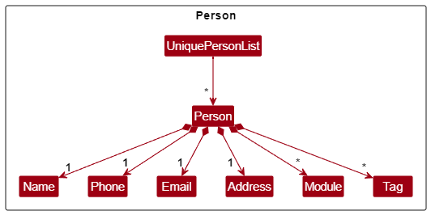

A Teammate is represented by a `Person` object, and is composed of several attributes. All `Person` objects are stored in a  `UniquePersonList`, which interacts with the `AddressBook` class in the [Model layer](#model-layer).

The attributes of the `Person` class represent:
- `Name`: The name of the teammate.
- `Phone`: The phone number of the teammate.
- `Email`: The email address of the teammate.
- `Address`: The address of the teammate.
- `Module`: The set of modules taken by the teammate.
- `Tag`: The set of tags that are related to the teammate.

:information_source: **Note:** Each `Person` object is uniquely identified by its `Email` attribute. This means that adding two teammates with the same email is not allowed. This is to allow teammates with the same names to be added.

#### Adding a Teammate

The command `person add` creates a new `Person` object, which contains the necessary fields that are associated with a teammate.

The activity diagram is represented below:

The sequence diagram of the command is represented below:

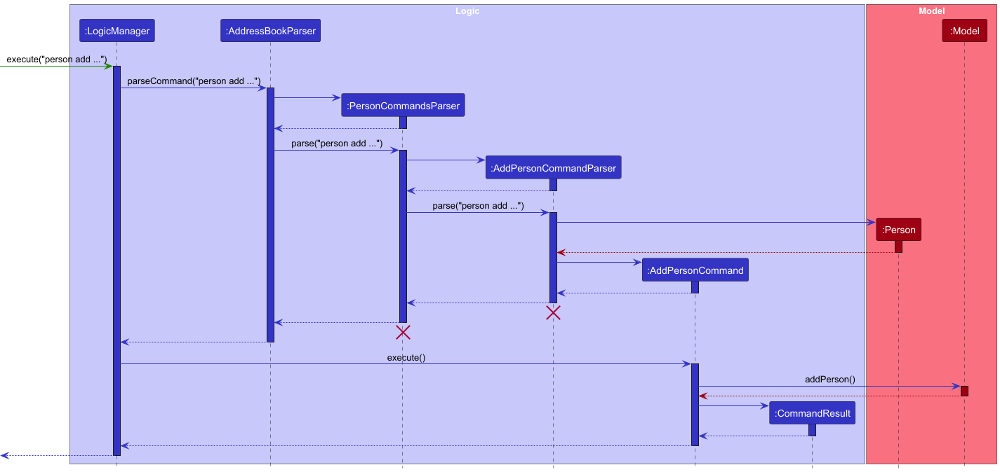

:information_source: **Note:** The sequence diagram does not show the instantiation of classes that represents the attributes of the `Person` object, as their behaviour is trivial and will clutter the diagram.

The method call `AddPersonCommandParser.parse()` was simplified and the validation checks for the attributes were ommited, as it would clutter the diagram. The full behaviour of the parser is described below:

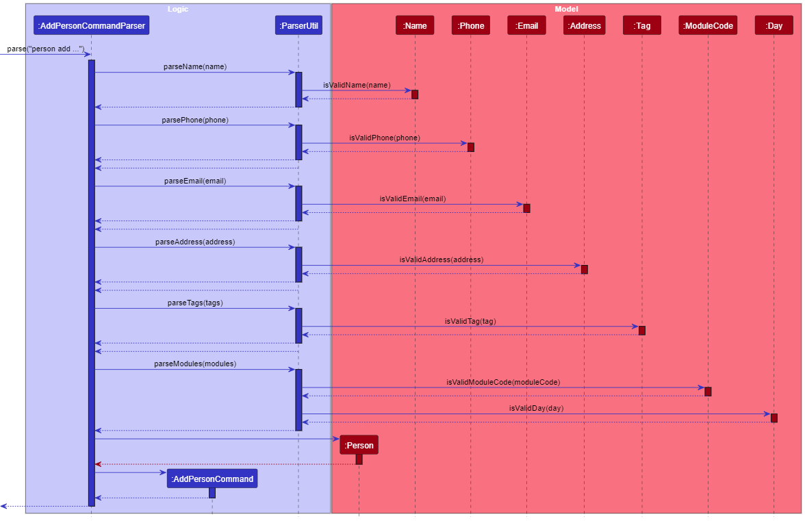

##### Notes

- Each teammate is uniquely identified by their email. This means that two `Person` objects that have the same email are considered to be the same teammate. This does not apply to the `equals` property, which checks for equality on all fields.
- The `Name` attribute must only consist of Latin alphanumerical characters, spaces, and allowed special characters (apostrophe and dash) only.
- The `Email` attribute must follow the following constraints:

  - 1. The local-part should only contain alphanumeric characters and these special characters, excluding the parentheses, (+\_.-). The local-part may not start or end with any special characters.

  - 2.  This is followed by a '@' and then a domain name. The domain name is made up of domain labels separated by periods. The domain name must:
    - end with a domain label at least 2 characters long
    - have each domain label start and end with alphanumeric characters
    - have each domain label consist of alphanumeric characters, separated only by hyphens, if any.

- The `Phone` attribute must consist of numbers only, and be at least 3 digits long.
- All attributes must not be empty (including whitespaces).
- If any of these constraints are to fail, the parser will throw an error based on the earliest field that fails in the above order.

##### Future Considerations

- The name constraint can be relaxed to include non-Latin alphabets, such as Chinese characters. This is not an urgent requirement, and given the NUS locality, it is likely that enforcing Latin alphabets is sufficient.

#### Editing a Teammate

The command `person edit` edits an existing `Person` object by its index.

The activity diagram is represented below:

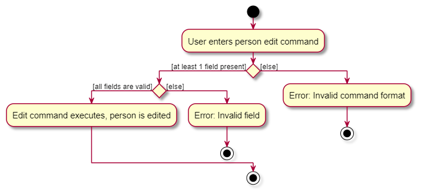

##### Notes

- The same restrictions mentioned in [Adding a Person](#adding-a-person) appplies here as well.

#### Deleting a Teammate

The command `person delete` deletes an existing `Person` object by its index.

The activity diagram is represented below:

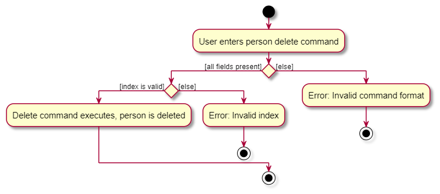

#### Searching for a Teammate

The command `person find` finds an existing `Person` object by a given predicate.

The activity diagram is represented below:

##### Notes

- The search predicate cannot be blank.

#### Listing All Teammates

The command `person list` displays all `Person` objects, sorted by name.

The activity diagram is represented below:

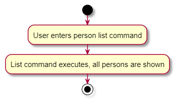

#### Exporting A Teammate

The command `person export` exports a `Person` object as text.

The activity diagram is represented below:

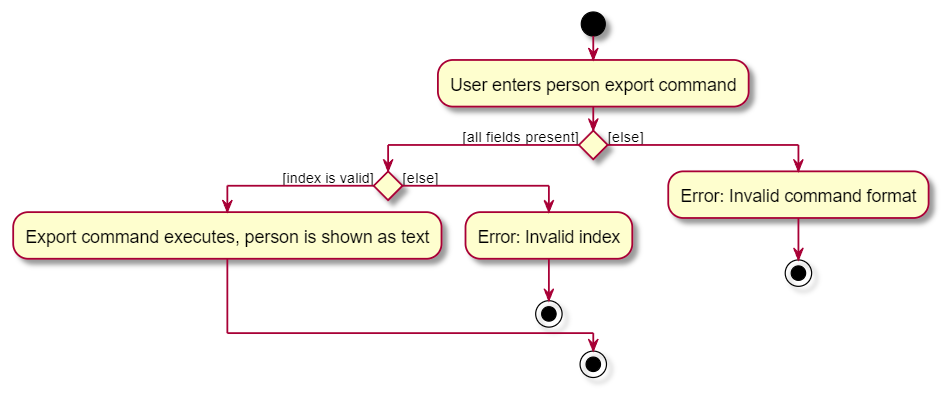

### Module

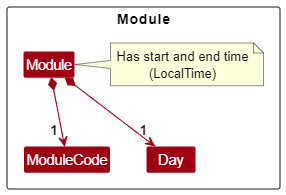

A Module is composed of several attributes:
- `ModuleCode`: The module code of the module.
- `Day`: The day of the module, stored as one of `"MON", "TUE", "WED", "THU", "FRI", "SAT", "SUN"`. 
- `startTime`: The start time of the module, stored as a  `LocalTime` object.
- `endTime`: The end time of the module, stored as a  `LocalTime` object.

:information_source: **Note:** Each `Module` object is uniquely identified by its `ModuleCode` attribute. This means that adding two modules with the module code is not allowed. It is also not possible to add a module with invalid times (i.e. start time later than end time), or to add a module when there is already an existing module within that time period.

#### Adding a Module for a Teammate

The command `module add` creates a new `Module` object, which contains the necessary fields that are associated with an NUS module.

The activity diagram is represented below:

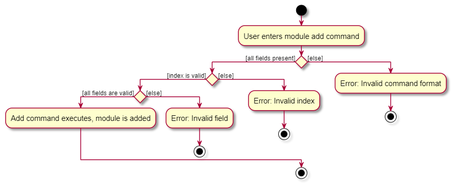

The implementation of the `module add` command is largely similar to the `Person` variation. 

#### Deleting a Module for a Teammate

The command `module delete` removes an existing `Module` from a `Person`.

The activity diagram is represented below:

The implementation of the `module delete` command is largely similar to the `Person` variation. 

### Meeting

A Meeting is composed of several attributes:
- `date`: The date of the meeting, stored as a `LocalDate` object.
- `startTime`: The start time of the meeting, stored as a  `LocalTime` object.
- `endTime`: The end time of the meeting, stored as a  `LocalTime` object.

:information_source: **Note:**
The startTime and endTime validation checks for `Meeting` is similar to `Module`. It is also not possible to add a meeting with invalid times (i.e. start time later than end time), or to add a meeting when there is already an existing meeting within that time period.

#### Adding a Meeting

The command `meeting add` creates a new `Meeting` object, which contains the necessary fields that are associated with an NUS module.

The activity diagram is represented below:

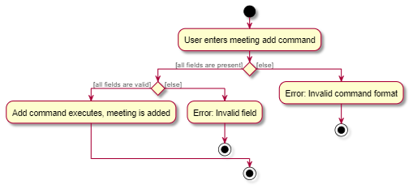

The implementation of the `meeting add` command is largely similar to the `Person` variation. 

#### Deleting a Meeting

The command `meeting delete` deletes an existing `Meeting`.

The activity diagram is represented below:

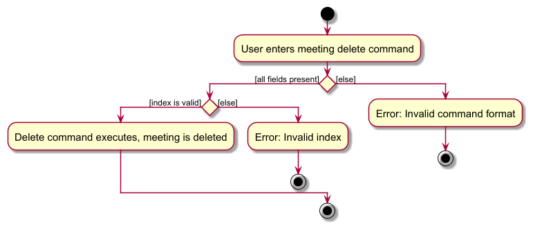

The implementation of the `meeting delete` command is largely similar to the `Person` variation.

### General Commands

#### Show Date

The command `showdate` update the timetable to show the specified date's week.

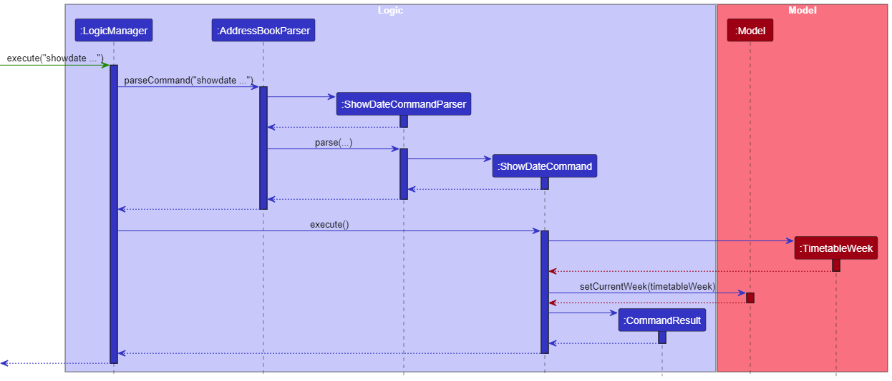

#### Help

The command `help` shows a message explaining how to access the user guide.

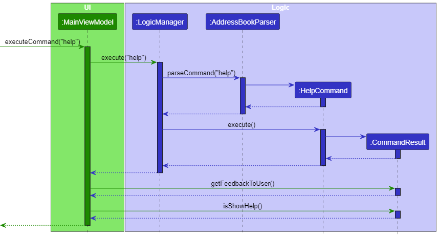

#### Clear

The command `clear` clears all teammates, modules and meetings from TeamSync.

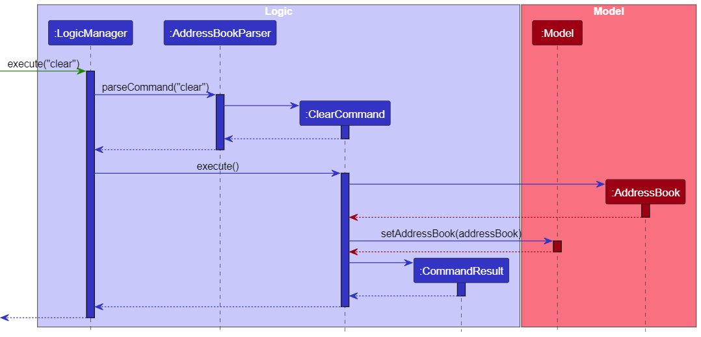

---

## **Documentation, logging, testing, configuration, dev-ops**

- [Documentation guide](Documentation.md)
- [Testing guide](Testing.md)
- [Logging guide](Logging.md)
- [Configuration guide](Configuration.md)
- [DevOps guide](DevOps.md)

---

## **Appendix: Requirements**

### Product scope

**Target user profile**:

- is an NUS student
- is taking multiple modules with group projects
- wants to be able to schedule meetings without any timetable clashes
- wants to keep track of tasks for each group project
- prefers typing to mouse interactions
- is comfortable with desktop apps and command-line interfaces (CLI)

**Value proposition**: TeamSync allows NUS students to efficiently manage group projects. TeamSync integrates contact management with availability tracking based on timetables, allowing for easy scheduling of meetings and tracking of tasks.

### User stories

Priorities: High (must have) - `* * *`, Medium (nice to have) - `* *`, Low (unlikely to have) - `*`

| Priority | As a …​         | I can …​                                                | So that I can…​                                                                 |
| -------- | --------------- | ------------------------------------------------------- | ------------------------------------------------------------------------------- |
| `* * *`  | First-time user | See usage instructions                                  | Refer to instructions when I forget how to use TeamSync                         |
| `* * *`  | First-time user | See sample data                                         | Understand how the data is visualised on TeamSync                               |
| `* * *`  | First-time user | Delete all data                                         | Remove all sample data to start using TeamSync                                  |
| `* * *`  | User            | Add a new contact                                       |                                                                                 |
| `* * *`  | User            | Delete a contact                                        | Remove contacts that I no longer need                                           |
| `* * *`  | User            | Edit a contact                                          | Fix mistakes or update contact details                                          |
| `* * *`  | User            | Find a contact by name                                  | Locate details of persons without having to go through the entire list          |
| `* * *`  | User            | Add a module to a contact                               | Keep track of which modules a person is taking and his availability             |
| `* * *`  | User            | Delete a module for a contact                           | Keep the module list up to date whenever a module ends                          |
| `* *`    | User            | Edit a module for a contact                             | Fix mistakes or update module details                                           |
| `*`      | User            | Filter contacts by module                               | Find who is taking the same module without having to go through the entire list |
| `* * *`  | User            | Create a meeting                                        | Plan for a group meeting                                                        |
| `* * *`  | User            | Delete a meeting                                        | Remove old or cancelled meetings                                                |
| `* *`    | User            | Edit a meeting                                          | Fix mistakes or update details of a meeting                                     |
| `* * *`  | User            | View all meetings                                       | Keep track of all meetings                                                      |
| `* * *`  | User            | View a contact's timetable                              | Easily visualise the contact's availability                                     |
| `* * *`  | User            | View collated timetable of currently displayed contacts | Easily visualise the common available slots of my contacts                      |
| `* * *`  | User            | View meetings in timetable                              | Easily visualise when are the meetings                                          |
| `* * *`  | User            | Change the week displayed in the timetable              | View the schedule of other weeks                                                |
| `*`      | Group member    | Create a group                                          | Easily find the contact details of my group members                             |
| `*`      | Group member    | Delete a group                                          | Delete groups when a group project is over                                      |
| `*`      | Group member    | Add a contact to a group                                | Keep track of my group members                                                  |
| `*`      | Group member    | Remove a contact from a group                           | Ensure that the group list stays updated whenever a group member leaves         |
| `*`      | Group member    | Create a task                                           | Track tasks effectively                                                         |
| `*`      | Group member    | Edit a task                                             | Fix mistakes or update task details                                             |
| `*`      | Group member    | Delete a task                                           | Delete old or cancelled tasks                                                   |
| `*`      | Group member    | Set task priorities                                     | Know which tasks to focus on first                                              |
| `*`      | Group member    | Set task responsibilities                               | Know who is responsible for completing a task                                   |
| `*`      | Group member    | Update task status                                      | Keep track of whether a task has been completed                                 |
| `*`      | Group member    | View completed tasks                                    | Keep track of what has been accomplished                                        |
| `*`      | Group member    | View uncompleted tasks                                  | Keep track of what is to be done                                                |
| `*`      | Group member    | View upcoming deadlines                                 | Keep track of tasks that are due soon                                           |

### Use cases

#### Use case: UC 01 - Add a teammate

**System**: TeamSync

**Actor**: User

**Preconditions**: User has the details of the teammate being added

**MSS**

1. User chooses to add a teammate
2. User enters the teammate contact details
3. TeamSync adds the teammate and displays a success message
4. TeamSync updates display to reflect the added teammate

   Use case ends

**Extensions**

2a. TeamSync detects an error in the entered details

- 2a1. TeamSync displays an error message
  Use case ends

#### Use case: UC 02 - Delete a teammate

**System**: TeamSync

**Actor**: User

**Preconditions**: User has the details of the teammate and has created the teammate

**MSS**

1. User chooses a teammate contact to delete
2. TeamSync deletes the teammate and displays a success message
3. TeamSync updates display to reflect the deleted teammate

   Use case ends

**Extensions**

1a. User selects an invalid teammate to delete

- 1a1. TeamSync displays an error message

  Use case ends

#### Use case: UC 03 - Edit a teammate

**System**: TeamSync

**Actor**: User

**Preconditions**: User has the new details of the teammate being updated

**MSS**

1. User chooses a teammate contact to edit
2. User enters the updated teammate contact details
3. TeamSync updates the teammate and displays a success message
4. TeamSync updates display to reflect the deleted teammate

   Use case ends

**Extensions**

1a. User selects an invalid teammate to update

- 1a1. TeamSync displays an error message

  Use case ends

2a. TeamSync detects an error in the entered details

- 2a1. TeamSync displays an error message

  Use case ends

#### Use case: UC 04 - List all teammates

**System**: TeamSync

**Actor**: User

**MSS**

1. User chooses to display all teammate
2. TeamSync displays all teammate

   Use case ends

#### Use case: UC 05 - Find teammate by name

**System**: TeamSync

**Actor**: User

**MSS**

1. User enters the name of the teammate
2. TeamSync displays teammates that match the name entered

   Use case ends

**Extensions**

2a. No teammate matches the name entered

- 2a1. TeamSync displays a message that no teammates matching the name is found

  Use case ends

#### Use case: UC 06 - Create a module for a teammate

**System**: TeamSync

**Actor**: User

**Preconditions**: User has the details of the module and teammate

**MSS**

1. User chooses a teammate to create a module for
2. User enters the module details
3. TeamSync adds the module and displays a success message
4. TeamSync updates display to reflect the added module

   Use case ends

**Extensions**

1a. User selects an invalid teammate

- 1a1. TeamSync displays an error message

  Use case ends

2a. User enters an invalid module

- 1a1. TeamSync displays an error message

  Use case ends

#### Use case: UC 07 - Delete a module for a teammate

**System**: TeamSync

**Actor**: User

**Preconditions**: User has the details of the module and teammate and has created the module and teammate

**MSS**

1. User chooses a teammate to delete a module from
2. User enters the module details
3. TeamSync deletes the module and displays a success message
4. TeamSync updates display to reflect the deleted module

   Use case ends

**Extensions**

1a. User selects an invalid teammate

- 1a1. TeamSync displays an error message

  Use case ends

2a. User selects an invalid module

- 1a1. TeamSync displays an error message

  Use case ends

#### Use case: UC 08 - Create a meeting

**System**: TeamSync

**Actor**: User

**Preconditions**: User has the details of the meeting

**MSS**

1. User chooses to create a meeting
2. User enters the meeting details
3. TeamSync displays a message that the meeting has been created successfully
4. TeamSync updates display to reflect the deleted meeting

   Use case ends

**Extensions**

2a. TeamSync detects an error in the entered meeting details

- 2a1. TeamSync displays an error message

  Use case ends

#### Use case: UC 09 - Delete a meeting

**System**: TeamSync

**Actor**: User

**Preconditions**: User has the details of the meeting and has created the meeting

**MSS**

1. User chooses to delete a meeting
2. TeamSync displays a message that the meeting has been deleted successfully
3. TeamSync updates display to reflect the deleted meeting

   Use case ends

**Extensions**

1a. TeamSync detects that an invalid meeting has been chosen

- 1a1. TeamSync displays an error message

  Use case ends

#### Use case: UC 10 - List all meetings

**System**: TeamSync

**Actor**: User

**MSS**

1. User chooses to list all meetings
2. TeamSync updates display to display all meetings

   Use case ends

### Non-Functional Requirements

1. TeamSync should work on any _mainstream OS_ as long as it has Java `17` or above installed.
2. TeamSync should be able to store up to 1000 contacts without a noticeable sluggishness in performance for typical usage.
3. A user with above average typing speed for regular English text (i.e. not code, not system admin commands) should be able to accomplish most of the tasks faster using commands than using the mouse.
4. TeamSync should respond to commands within 1 second under regular operating conditions
5. TeamSync should work without requiring an installer.
6. TeamSync should not depend on a remote server.
7. TeamSync's GUI should not cause any resolution-related inconveniences to the user for
   - standard screen resolutions 1920x1080 and higher, and
   - for screen scales 100% and 125%.
8. TeamSync's GUI should allow for all functions to be used even if the user experience is not optimal for
   - resolutions 1280x720 and higher, and
   - for screen scales 150%.
9. TeamSync's data should be stored locally in a human editable text file.
10. TeamSync should be packaged into a single JAR file.
11. TeamSync should work on Windows, Linux, and OS-X platforms.
12. TeamSync should not be larger than 100MB.
13. Documentation should not exceed 15MB per file.
14. The developer guide and user guide should be PDF-friendly.

### Glossary

- **CLI**: Command Line Interface
- **GUI**: Graphical User Interface
- **Invalid meeting**: A meeting the user specified when prompted by TeamSync which does not exist
- **Invalid module**: A module the user specified when prompted by TeamSync which does not exist
- **Invalid teammate**: A contact the user specified when prompted by TeamSync which does not exist

---

## **Appendix: Instructions for manual testing**

Given below are instructions to test the app manually.

:information_source: **Note:** These instructions only provide a starting point for testers to work on;
testers are expected to do more *exploratory* testing.

### Launch

1. Initial launch

   1. Download the jar file and copy into an empty folder

   2. Double-click the jar file Expected: Shows the GUI with a set of sample teammates. The window size may not be optimum.

1. Saving window preferences

   1. Resize the window to an optimum size. Move the window to a different location. Close the window.

   2. Re-launch the app by double-clicking the jar file. 
      Expected: The most recent window size and location is retained.

### Teammate

#### Add a new teammate

Prerequisite: There is no teammate with the email "takashi@yamada.com"
 
Input Command: `person add -n Takashi Yamada -p 12345678 -e takashi@yamada.com -a 123 Sakura Street -t owesMoney`
 
Expected Output: The command box displays "New person added: Takashi Yamada; Phone: 12345678; Email: takashi@yamada.com; Address: 123 Sakura Street; Modules: ; Tags: \[owesMoney\]"

Prerequisite: The previous command was entered once.
 
Input Command: `person add -n Takashi Yamada -p 12345678 -e takashi@yamada.com -a 123 Sakura Street -t owesMoney`
 
Expected Output: The command box displays "This person already exists in the address book.
Ensure that the email address is different from an existing one. "

Input Command: `person add -n Takashi@Yamada -p 12345678 -e takashi@yamada.com -a 123 Sakura Street -t owesMoney`
 
Expected Output: The command box displays "Names should only contain alphanumeric characters and spaces, and it should not be blank"

#### Edit a teammate

Prerequisite: At least 1 teammate have been added
 
Input Command: `person edit 1 -n Takashi Sato`
 
Expected Output: The command box displays "Edited Person: Takashi Sato; ...", where ... represents the other attributes of the teammate.

Prerequisite: Less than 3 teammates have been added
 
Input Command: `person edit 4 -n Takashi Sato`
 
Expected Output: The command box displays "The person index provided is invalid"

#### Delete a teammate

Prerequisite: At least 1 teammate have been added
 Input Command: `person delete 1`
 Expected Output: The command box displays "Deleted Person: ...", where ... represents the other attributes of the teammate.

Prerequisite: Less than 3 teammates have been added
 Input Command: `person delete 4`
 Expected Output: The command box displays "The person index provided is invalid"

#### List all teammates

Input Command: `person list`
 Expected Output: The command box displays "Listed all persons"

#### Search for a teammate

Prerequisite: At least 1 teammate that contains the name "Takashi" has been added
 Input Command: `person find Takashi`
 Expected Output: The command box displays "# persons listed!", where # is the number of teammates that contain the name "Takashi"

### Module

#### Add a module for a teammate

Prerequisite: At least 1 teammate have been added, no modules with the code "CS2103T" exist for that teammate, and there are no modules between 14:00 and 16:00 on Friday for that teammate
 Input Command: `module add 1 CS2103T FRI 14:00 16:00`
 Expected Output: The command box displays "Added Module to Person: ... Modules: [CS2103T - FRI 14:00 to 16:00]...", where ... represents the other attributes of the teammate.

Prerequisite: At least 1 teammate have been added, no modules with the code "CS2101" exist for that teammate, and there is at least 1 module between 14:00 and 16:00 on Friday for that teammate
 Input Command: `module add 1 CS2101 FRI 14:00 16:00`
 Expected Output: The command box displays "This person already has another module during this period."

#### Delete a module for a teammate

Prerequisite: At least 1 teammate have been added, with a module "CS2101"
 Input Command: `module delete 1 CS2103T`
 Expected Output: The command box displays "Deleted Module from: ...", where ... represents the other attributes of the teammate.

Prerequisite: At least 1 teammate have been added, with no module with the code "CS2103T"
 Input Command: `module delete 1 CS2103T`
 Expected Output: The command box displays "The person does not have the provided module assigned to them"

### Meeting

#### Add a meeting

Prerequisite: There are no meetings on 15-11-2025 between 11:00 and 15:00
 Input Command: `meeting add 15-11-2025 11:00 15:00`
 Expected Output: The command box displays "Meeting added with the following details: 15-11-2025; Start time: 11:00; End time: 15:00"

Prerequisite: There is at least one meeting on 15-11-2025 between 11:00 and 14:00
 Input Command: `meeting add 15-11-2025 11:00 14:00`
 Expected Output: The command box displays "There is another meeting during this time period already. "

#### Delete a meeting

Prerequisite: There is at least 1 meeting added
 Input Command: `meeting delete 1`
 Expected Output: The command box displays "Deleted Meeting: ...", where ... represents the details of the meeting

Prerequisite: Less than 3 meetings have been added
 Input Command: `meeting delete 4`
 Expected Output: The command box displays "The meeting index provided is invalid"

### Exit

 Input Command: `exit`
 Expected Behaviour: The app closes.

## **Appendix: Planned Enhancements**

_Coming soon ..._

## **Appendix: Effort**

### Difficulty Level

Our project is significantly more advanced than AB3, featuring new commands and enhanced functionalities. Student objects now include a modules attribute for schedule coordination. The UI is also more complex, incorporating a timetable view that displays shared schedules and scheduled meetings for the week.

### Challenges Faced

UI update: Providing a fresh look for the application with colours more appealing than AB3 as well as the new timetable view required multiple revisions.\
Schedule logic: Introduction of logic for modules and meetings required careful planning on implementation as well as how to display them in the application

### Effort Required

Our project involved substantial effort in several key areas:

Refactoring: Codebase was refactored to MVVM architecture to better facilitate development\
Commands: Multiple new commands were added and existing commands modified to better suit our application\
UI: Effort was required for the new timetable view and how schedules were displayed as well as the ability to modify the current view

### Achievements

# We have enhanced the AB3 application with new features and design to better suit project management of NUS students
