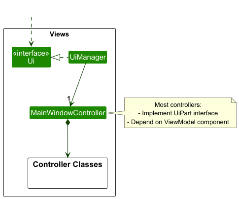

## About TeamSync

TeamSync is a contact management app designed to streamline group project management **for NUS students**. TeamSync combines the intuitive visuals of a Graphical User Interface (GUI) with the speed and precision of a Command Line Interface (CLI), enabling students to effortlessly manage teammates' contact details, schedule meetings, and stay organized.

This Developer Guide documents the architecture and design of TeamSync, as well as how selected features are implemented.

---

* Table of Contents
{:toc}

---

## Acknowledgements

TeamSync is built on [AddressBook Level-3](https://se-education.org/addressbook-level3/) which is part of the SE-EDU initiative.

Software Dependencies

| Dependency                                      | Use              |
| ----------------------------------------------- | ---------------- |
| [Gradle](https://gradle.org/)                   | Build Automation |
| [JavaFX](https://openjfx.io/)                   | GUI              |
| [Jackson](https://github.com/FasterXML/jackson) | JSON Parser      |
| [JUnit5](https://github.com/junit-team/junit5)  | Testing          |
| [AtlantaFX](https://github.com/mkpaz/atlantafx) | GUI CSS          |
| [Ikonli](https://github.com/kordamp/ikonli)     | Icon Pack        |

Documentation Dependencies

| Dependency                                | Use            |
| ----------------------------------------- | -------------- |
| [Jekyll](https://jekyllrb.com/)           | Site Rendering |
| [PlantUML](https://plantuml.com/)         | UML Diagrams   |
| [GitHub Pages](https://pages.github.com/) | Site Hosting   |

---

## Setting up, getting started

Refer to the guide [_Setting up and getting started_](SettingUp.md).

---

## Design

### Architecture

The **_Architecture Diagram_** given above explains the high-level design of the App.

Given below is a quick overview of main components and how they interact with each other.

**Main components of the architecture**

**`Main`** (consisting of classes [`Main`](https://github.com/AY2425S2-CS2103T-F10-1/tp/blob/master/src/main/java/syncsquad/teamsync/Main.java) and [`MainApp`](https://github.com/AY2425S2-CS2103T-F10-1/tp/blob/master/src/main/java/syncsquad/teamsync/MainApp.java)) is responsible for the app launch and shutdown.

- At app launch, it initializes the other components in the correct sequence, and connects them up with each other.
- At shutdown, it shuts down the other components and invokes cleanup methods where necessary.

The bulk of the app's work is done by the following five components:

- [**`View (FXML + Controller)`**](#view-component-fxml--controller): The UI presentation of the app.
- [**`Viewmodel`**](#viewmodel-component): Manages the presentation logic and state of the UI.
- [**`Logic`**](#logic-component): The command executor.
- [**`Model`**](#model-component): Holds the data of the app in memory.
- [**`Storage`**](#storage-component): Reads data from, and writes data to, the hard disk.

[**`Commons`**](#common-classes) represents a collection of classes used by multiple components.

**How the architecture components interact with each other**

The _Sequence Diagram_ below shows how the components interact with each other for the scenario where the user issues the command `person delete 1`.

Each of the five main components (also shown in the diagram above),

- defines its _API_ in an `interface` with the same name as the Component.
- implements its functionality using a concrete `{Component Name}Manager` class (which follows the corresponding API `interface` mentioned in the previous point).

For example, the `Logic` component defines its API in the `Logic.java` interface and implements its functionality using the `LogicManager.java` class which follows the `Logic` interface. Other components interact with a given component through its interface rather than the concrete class (reason: to prevent outside component's being coupled to the implementation of a component), as illustrated in the (partial) class diagram below.

The sections below give more details of each component.

### View component (FXML + Controller)

This component represents the View component of the MVVM (Model-View-ViewModel) architecture. It is responsible for:

- Rendering the user interface and handling user input
- Displaying data from the ViewModel
- Converting user actions into commands that are sent to the ViewModel
- Updating the UI in response to data changes in the ViewModel

This separation of concerns allows the View to focus purely on presentation while delegating data handling to the ViewModel.

The View component is initialized through the [`Ui`](https://github.com/AY2425S2-CS2103T-F10-1/tp/blob/master/src/main/java/syncsquad/teamsync/controller/Ui.java) interface, which serves as the entry point for UI initialization.

The UI consists of a `MainWindowController` that is made up of these other `Controller Classes`:
- `CommandBoxController`
- `HelpWindowController`
- `MeetingTreeViewController`
- `PersonTreeViewController`
- `ResultDisplayController`
- `StatusBarFooterController`
- `TimetableController`

All the `Controller Classes`, including the `MainWindowController`, inherit from the abstract `UiPart` class which captures the commonalities between classes that represent parts of the visible GUI.

The `Controller` classes are built using the JavaFX UI framework, where each UI component's layout is defined in corresponding `.fxml` files located in the `src/main/resources/view` folder. These controllers manage user interactions and communicate with the ViewModel component. For instance, the [`MainWindowController`](https://github.com/AY2425S2-CS2103T-F10-1/tp/blob/master/src/main/java/syncsquad/teamsync/controller/MainWindowController.java) has its layout defined in [`MainWindow.fxml`](https://github.com/AY2425S2-CS2103T-F10-1/tp/blob/master/src/main/resources/view/MainWindow.fxml).

We make use of AtlantaFX Styles to style in-line in controller files as much as possible. FXML files are used to embed controller logic and are intended to be thin UI wireframes, as opposed to fully fledged interfaces.

### ViewModel component

The ViewModel component serves as the intermediary between the View and Model components in the MVVM (Model-View-ViewModel) architecture. It is responsible for:

- Managing the presentation logic and state of the UI
- Converting data from the Model into a format suitable for display
- Handling user input and converting it into commands for the Logic component
- Maintaining the state of UI components
- Providing data bindings for the View component

The ViewModel component consists of several specialized view models:

- **`MainViewModel`**: The central view model that coordinates all other view models and manages the overall application state.
- **`CommandBoxViewModel`**: Handles the command input functionality, managing the command text and execution.
- **`ResultDisplayViewModel`**: Manages the display of command results and feedback messages.
- **`PersonListViewModel`**: Handles the presentation logic for the person list, including filtering and sorting.
- **`MeetingListViewModel`**: Manages the display and state of meetings, including scheduling and conflicts.
- **`CurrentWeekViewModel`**: Handles the display of the current week's schedule and time-related information.

Each view model:

- Depends on the Model component for data
- Provides observable properties that the View can bind to
- Handles the conversion of Model data into displayable formats
- Manages the state of its corresponding UI component
- Communicates with the Logic component for command execution

The ViewModel component follows these design principles:

1. **Separation of Concerns**: Each view model is responsible for a specific aspect of the UI
2. **Data Binding**: Uses JavaFX's property system for automatic UI updates
3. **Dependency Management**: Maintains clear dependencies on Model and Logic components
4. **State Management**: Handles UI state independently of the View component

### Logic component

**API** : [`Logic.java`](https://github.com/AY2425S2-CS2103T-F10-1/tp/blob/master/src/main/java/syncsquad/teamsync/logic/Logic.java)

Here's a (partial) class diagram of the `Logic` component:

The Logic component is responsible for:

- Processing user commands and executing them
- Managing the command parsing and execution flow
- Coordinating between the ViewModel and Model components
- Handling command validation and error checking
- Providing feedback on command execution results

The Logic component consists of several key components:

- **`LogicManager`**: The main implementation of the `Logic` interface that orchestrates command execution
- **`Messages`**: Contains common message strings used throughout the application
- **Command Parsers**: Located in the `parser` package, responsible for parsing user input into executable commands
- **Commands**: Located in the `commands` package, implementing the actual command logic

How the `Logic` component works:

1. When a command is received from the ViewModel component, the `LogicManager` processes it through the following steps:

   - The command string is passed to the appropriate parser in the `parser` package
   - The parser validates the command format and parameters
   - A corresponding `Command` object is created
   - The command is executed, interacting with the Model component as needed
   - A `CommandResult` is returned to the ViewModel component

2. The command execution flow:

   - Commands can modify the Model's state (e.g., adding/removing persons, meetings)
   - Commands can query the Model for information
   - Commands can trigger UI updates through the ViewModel
   - All command results include feedback messages for the user

3. Error handling:
   - Invalid commands are caught and reported with helpful error messages
   - Command-specific validation ensures data integrity
   - Exceptions are properly handled and converted to user-friendly messages

Here are the other classes in `Logic` (omitted from the class diagram above) that are used for parsing a user command:

How the parsing works:

- When called upon to parse a user command, the `AddressBookParser` class creates an `XYZCommandParser` (`XYZ` is a placeholder for the specific command name e.g., `AddCommandParser`) which uses the other classes shown above to parse the user command and create a `XYZCommand` object (e.g., `AddCommand`) which the `AddressBookParser` returns back as a `Command` object.
- All `XYZCommandParser` classes (e.g., `AddCommandParser`, `DeleteCommandParser`, ...) inherit from the `Parser` interface so that they can be treated similarly where possible e.g, during testing.

### Model component

**API** : [`Model.java`](https://github.com/AY2425S2-CS2103T-F10-1/tp/blob/master/src/main/java/syncsquad/teamsync/model/Model.java)

The Model component is responsible for:

- Managing the application's data and business logic
- Maintaining data integrity and consistency
- Providing data access and manipulation methods
- Supporting data observation through observable properties
- Managing user preferences and settings

The Model component consists of several key components:

- **`ModelManager`**: The main implementation of the `Model` interface that manages all data operations
- **`AddressBook`**: The central data structure that holds all application data
- **`UniqueItemList`**: A generic list implementation that ensures uniqueness of items
- **`UserPrefs`**: Manages user preferences and settings

The Model component is organized into several packages:

- **`person`**: Contains classes related to person management
- **`meeting`**: Contains classes related to meeting management
- **`module`**: Contains classes related to module management
- **`tag`**: Contains classes related to tag management
- **`util`**: Contains utility classes used across the model

Key features of the Model component:

1. **Data Management**:

   - Stores and manages all application data (persons, meetings, modules, etc.) in storage component
   - Ensures data consistency and integrity
   - Provides methods for data manipulation and retrieval
   - Maintains relationships between different data entities

2. **Observable Properties**:

   - Exposes data through observable lists for UI binding
   - Notifies observers of data changes
   - Supports filtered views of data
   - Enables real-time UI updates

3. **Data Access**:

   - Provides read-only interfaces for data access
   - Implements data validation and constraints
   - Supports data filtering and searching
   - Manages data relationships and dependencies

4. **User Preferences**:
   - Stores user-specific settings in storage component
   - Provides read-only access to preferences
   - Supports preference modification
   - Persists preferences across sessions

The Model component follows these design principles:

1. **Encapsulation**: Data access is controlled through well-defined interfaces
2. **Immutability**: Data objects are immutable to ensure consistency
3. **Dependency Inversion**: Higher-level components depend on abstractions
4. **Single Responsibility**: Each class has a specific, well-defined purpose

:information_source: **Note:** The Model component is designed to be only dependent on the Storage component, allowing it to be tested and modified without affecting the rest of the application.

### Storage component

**API** : [`Storage.java`](https://github.com/AY2425S2-CS2103T-F10-1/tp/blob/master/src/main/java/syncsquad/teamsync/storage/Storage.java)

The Storage component is responsible for:

- Persisting application data to and from the file system
- Managing data serialization and deserialization
- Handling data format conversion
- Providing data backup and recovery capabilities
- Managing user preferences storage

The Storage component consists of several key components:

- **`StorageManager`**: The main implementation of the `Storage` interface that coordinates all storage operations
- **`JsonAddressBookStorage`**: Handles the storage of address book data in JSON format
- **`JsonUserPrefsStorage`**: Manages the storage of user preferences in JSON format
- **`JsonSerializableAddressBook`**: Represents the serializable version of the address book
- **`JsonAdaptedPerson`**: Handles the conversion between Person objects and JSON
- **`JsonAdaptedMeeting`**: Handles the conversion between Meeting objects and JSON
- **`JsonAdaptedModule`**: Handles the conversion between Module objects and JSON
- **`JsonAdaptedTag`**: Handles the conversion between Tag objects and JSON

Key features of the Storage component:

1. **Data Persistence**:

   - Saves application data to JSON files
   - Loads data from JSON files
   - Maintains data integrity during save/load operations
   - Handles file I/O operations safely

2. **Data Conversion**:

   - Converts between Java objects and JSON format
   - Handles complex object relationships
   - Maintains data consistency during conversion
   - Validates data during deserialization

3. **User Preferences**:

   - Stores user preferences in a separate file
   - Loads preferences on application startup
   - Updates preferences when modified
   - Maintains preference consistency

4. **Error Handling**:
   - Handles file system errors gracefully
   - Provides meaningful error messages
   - Maintains data integrity during errors
   - Supports data recovery when possible

:information_source: **Note:** The Storage component is designed to be independent of the Model component's implementation details, allowing for changes in the data model without affecting storage operations.

### Common classes

Classes used by multiple components are organized in the `syncsquad.teamsync.commons` package, which is divided into several subpackages:

1. **`core`**:

   - Contains fundamental classes that define the core behavior of the application
   - Provides base classes and interfaces used across different components
   - Defines common data structures and utilities

2. **`exceptions`**:

   - Contains custom exception classes used throughout the application
   - Provides specialized exception handling for different scenarios
   - Includes error messages and recovery suggestions

3. **`util`**:
   - Contains utility classes and helper methods
   - Provides common functionality used across different components
   - Includes string manipulation, date handling, and other utility functions

:information_source: **Note:** The Common classes are designed to be independent of specific components, allowing them to be used across the entire application without creating unnecessary dependencies.

---

## Implementation

This section describes some noteworthy details on how certain features are implemented.

There are 4 main command groups:

- Teammate (`person`)
- Module (`module`)
- Meeting (`meeting`)
- General

<!--div markdown="span" class="alert alert-info">:information_source: **Note:** Some note here.

</div-->

### Teammate

A Teammate is represented by a `Person` object, and is composed of several attributes. All `Person` objects are stored in a  `UniquePersonList`, which interacts with the `AddressBook` class in the [Model component](#model-component).

The attributes of the `Person` class represent:
- `Name`: The name of the teammate.
- `Phone`: The phone number of the teammate.
- `Email`: The email address of the teammate.
- `Address`: The address of the teammate.
- `Module`: The set of modules taken by the teammate.
- `Tag`: The set of tags that are related to the teammate.

:information_source: **Note:** See the [glossary](#glossary) for how duplicate teammates are identified.

#### Adding a new teammate

The command `person add` creates a new `Person` object, which contains the necessary fields that are associated with a teammate.

The activity diagram is represented below:

The sequence diagram of the command is represented below:

:information_source: **Note:** 
* The lifeline for `PersonCommandsParser`, `AddPersonCommandParser` and `AddPersonCommand` should end at the destroy marker (X) but due to a limitation of PlantUML, the lifeline continues till the end of diagram.

* The sequence diagram does not show the instantiation of classes that represents the attributes of the `Person` object, as their behaviour is trivial and will clutter the diagram.

The method call `AddPersonCommandParser.parse()` was simplified and the validation checks for the attributes were ommited, as it would clutter the diagram. The full behaviour of the parser is described below:

:information_source: **Note:**

The following restrictions apply to the attributes:

* Names should only contain alphanumeric characters, spaces, and the following special characters (`'`,`/` and `-`).

* Phone numbers should only contain numbers, and it should be at least 3 digits long.

* Emails should be of the format local-part@domain.

* Tags should only contain alphanumeric characters.

* Users should avoid using [command line flag patterns](#glossary) as they _might_ cause an error.

#### Editing a teammate

The command `person edit` edits an existing `Person` object by its index.

The activity diagram is represented below:

#### Deleting a teammate

The command `person delete` deletes an existing `Person` object by its index.

The activity diagram is represented below:

#### Searching for a teammate

The command `person find` finds an existing `Person` object by a given predicate.

The activity diagram is represented below:

#### Listing all teammates

The command `person list` displays all `Person` objects, sorted by name.

The activity diagram is represented below:

#### Exporting a teammate

The command `person export` exports a `Person` object as text.

The activity diagram is represented below:

### Module

A Module is composed of several attributes:
- `Module code`
- `Day of week`
- `Start time`
- `End time`

:information_source: **Note:**  See the [glossary](#glossary) for how duplicate and overlapping modules are identified.

#### Adding a module for a teammate

The command `module add` creates a new `Module` object, which contains the necessary fields that are associated with an NUS module.

The activity diagram is represented below:

#### Deleting a module from a teammate

The command `module delete` removes an existing `Module` from a `Person`.

The activity diagram is represented below:

### Meeting

A Meeting is composed of several attributes:
- `Date`
- `Start time`
- `End time`

:information_source: **Note:** See the [glossary](#glossary) for how duplicate and overlapping meetings are identified.

#### Adding a meeting

The command `meeting add` creates a new `Meeting` object, which contains the necessary fields that are associated with an NUS module.

The activity diagram is represented below:

#### Deleting a meeting

The command `meeting delete` deletes an existing `Meeting`.

The activity diagram is represented below:

### General Commands

#### Viewing help

The command `help` shows a message explaining how to access the user guide.

#### Changing week displayed

The command `showdate` changes the week displayed in the timetable view in TeamSync.

#### Clearing all data

The command `clear` clears all teammates, modules and meetings from TeamSync.

---

## Documentation, logging, testing, configuration, dev-ops

- [Documentation guide](Documentation.md)
- [Testing guide](Testing.md)
- [Logging guide](Logging.md)
- [Configuration guide](Configuration.md)
- [DevOps guide](DevOps.md)

---

## Appendix: Requirements

### Product scope

**Target user profile**:

- is an NUS student
- is taking modules with group projects
- wants to be able to schedule meetings for their group projects
- wants to keep track of tasks for each group project
- prefers typing to mouse interactions
- is comfortable with desktop apps and command-line interfaces (CLI)

**Value proposition**:

TeamSync allows NUS students to efficiently manage their group projects by:
1. quickly **adding, editing and deleting** the contact details of their teammates
2. **managing** each teammate's modules and time commitments
3. **scheduling** meetings
4. **visualising** the team's contact details and schedules

### User stories

Priorities: High (must have) - `* * *`, Medium (nice to have) - `* *`, Low (unlikely to have) - `*`

| Priority | As a …​                           | I can …​                                              | So that I can…​                                                                   |
|---------|-----------------------------------|-------------------------------------------------------|-----------------------------------------------------------------------------------|
| `* * *` | First-time user                   | See usage instructions                                | Refer to instructions when I forget how to use TeamSync                           |
| `* * *` | First-time user                   | See sample data                                       | Understand how the data is visualised on TeamSync                                 |
| `* * *` | First-time user                   | Delete all data                                       | Remove all sample data to start using TeamSync                                    |
| `* * *` | User                              | Add a new teammate                                    | Store the details of my teammates                                                 |
| `* * *` | User                              | Delete a teammate                                     | Remove teammates that I no longer need                                            |
| `* * *` | User                              | Edit a teammate's details                             | Fix mistakes or update details of my teammates                                    |
| `* * *` | User                              | Find a teammate by name                               | Locate details of persons without having to go through the entire list            |
| `* * *` | User                              | List all teammates                                    | Refer to the details of all my teammates                                          |
| `* * *` | User                              | Add a module for a teammate                           | Keep track of which modules a person is taking and his availability               |
| `* * *` | User                              | Delete a module from a teammate                       | Keep the module list up to date whenever a module ends                            |
| `* *`   | User                              | Edit a module for a teammate                          | Fix mistakes or update module details                                             |
| `*`     | User                              | Filter teammates by module                            | Find who is taking the same module without having to go through the entire list   |
| `* * *` | User                              | Add a meeting                                         | Plan for a group meeting                                                          |
| `* * *` | User                              | Delete a meeting                                      | Remove old or cancelled meetings                                                  |
| `* *`   | User                              | Edit a meeting                                        | Fix mistakes or update details of a meeting                                       |
| `* * *` | User                              | List all meetings                                     | Keep track of all meetings                                                        |
| `* * *` | User                              | View my team's schedule in a timetable view           | Easily visualise my team's schedule                                               |
| `* *`   | User                              | Change the date range displayed in the timetable view | View my team's schedule for other date ranges                                     |
| `*`     | User                              | Create a task                                         | Track tasks effectively                                                           |
| `*`     | User                              | Edit a task                                           | Fix mistakes or update task details                                               |
| `*`     | User                              | Delete a task                                         | Delete old or cancelled tasks                                                     |
| `*`     | User                              | Set task priorities                                   | Know which tasks to focus on first                                                |
| `*`     | User                              | Set task responsibilities                             | Know who is responsible for completing a task                                     |
| `*`     | User                              | Update task status                                    | Keep track of whether a task has been completed                                   |
| `*`     | User                              | View completed tasks                                  | Keep track of what has been accomplished                                          |
| `*`     | User                              | View uncompleted tasks                                | Keep track of what is to be done                                                  |
| `*`     | User                              | View upcoming deadlines                               | Keep track of tasks that are due soon                                             |
| `*`     | User                              | Undo the last command                                 | Revert any changes in case I made a mistake                                       |
| `*`     | User with multiple group projects | Create a group for a module                           | Easily find the details of my group members for a specific module's group project |
| `*`     | User with multiple group projects | Delete a group for a module                           | Delete groups when a group project is over                                        |
| `*`     | User with multiple group projects | Add a teammate to a group                             | Keep track of my group members for a specific group project                       |
| `*`     | User with multiple group projects | Remove a teammate from a group                        | Ensure that the group list stays updated whenever a group member leaves           |
| `*`     | Experienced user                  | Use aliases / shortcuts for commands                  | Use TeamSync more efficiently                                                     |

### Use cases (implemented)

The following use cases have been implemented.

#### Use case: UC 01 - See usage instructions

**System**: TeamSync

**Actor**: User

**MSS**

1. User requests to see usage instructions.
2. TeamSync displays usage instructions.

   Use case ends.

#### Use case: UC 02 - Delete all data

**System**: TeamSync

**Actor**: User

**MSS**

1. User requests to delete all data.
2. TeamSync deletes all data and displays a success message.
3. TeamSync updates display to reflect the cleared data.

   Use case ends.

#### Use case: UC 03 - Add a new teammate

**System**: TeamSync

**Actor**: User

**Preconditions**: User has the details of the teammate being added.

**MSS**

1. User chooses to add a teammate, providing their contact details.
2. TeamSync adds the teammate and displays a success message.
3. TeamSync updates display to reflect the added teammate.

   Use case ends.

**Extensions**

- 1a. TeamSync detects an error in the entered details.
  - 1a1. TeamSync displays an error message.
  
    Use case ends.

- 1b. TeamSync detects that the teammate being added is a duplicate.
  - 1b1. TeamSync displays an error message.
  
    Use case ends.

#### Use case: UC 04 - Delete a teammate

**System**: TeamSync

**Actor**: User

**Preconditions**: The teammate to be deleted must exist in TeamSync.

**MSS**

1. User chooses to delete a teammate.
2. TeamSync deletes the teammate and displays a success message.
3. TeamSync updates display to reflect the deleted teammate.

   Use case ends.

**Extensions**

- 1a. User selects an invalid teammate to delete.
  - 1a1. TeamSync displays an error message.

  Use case ends.

#### Use case: UC 05 - Edit a teammate

**System**: TeamSync

**Actor**: User

**Preconditions**:
- User has the new details of the teammate being edited.
- The teammate to be edited must exist in TeamSync.

**MSS**

1. User chooses to edit a teammate, providing their updated contact details.
2. TeamSync updates the teammate and displays a success message.
3. TeamSync updates display to reflect the edited teammate.

   Use case ends.

**Extensions**

- 1a. User selects an invalid teammate to edit.
  - 1a1. TeamSync displays an error message.

    Use case ends.

- 1b. TeamSync detects an error in the entered details.
  - 1b1. TeamSync displays an error message.

    Use case ends

#### Use case: UC 06 - Find a teammate by name

**System**: TeamSync

**Actor**: User

**Preconditions**: The teammate that is being searched for must exist in TeamSync.

**MSS**

1. User chooses to find a teammate, providing at least one search keyword.
2. TeamSync displays teammates that match the search keywords.

   Use case ends

#### Use case: UC 07 - List all teammates

**MSS**

1. User chooses to list all teammates.
2. TeamSync displays all teammate.

   Use case ends.

#### Use case: UC 08 - Add a module for a teammate

**System**: TeamSync

**Actor**: User

**Preconditions**:
- User has the details of the module.
- The teammate must exist in TeamSync.

**MSS**

1. User chooses to add a module for a teammate, providing the module details.
2. TeamSync adds the module to the specified teammate and displays a success message.
3. TeamSync updates display to reflect the added module.

   Use case ends.

**Extensions**
- 1a. User selects an invalid teammate to add a module for.
    - 1a1. TeamSync displays an error message.

      Use case ends.

- 1b. TeamSync detects an error in the module details.
    - 1b1. TeamSync displays an error message.

      Use case ends.

- 1c. TeamSync detects that the module is an overlapping module.
    - 1c1. TeamSync displays an error message.

      Use case ends.

#### Use case: UC 09 - Delete a module from a teammate

**System**: TeamSync

**Actor**: User

**Preconditions**:
- The teammate must exist in TeamSync.
- The module must have been added to the teammate.

**MSS**

1. User chooses to delete a module from a teammate.
2. TeamSync deletes the module from the specified teammate and displays a success message.
3. TeamSync updates display to reflect the deleted module.

   Use case ends.

**Extensions**
- 1a. User selects an invalid teammate to delete a module from.
    - 1a1. TeamSync displays an error message.

      Use case ends.

- 1b. User selects an invalid module to delete.
    - 1b1. TeamSync displays an error message.

      Use case ends.

#### Use case: UC 10 - Add a meeting

**System**: TeamSync

**Actor**: User

**Preconditions**: User has the details of the meeting being added.

**MSS**

1. User chooses to add a meeting, providing the meeting details.
2. TeamSync adds the meeting and displays a success message.
3. TeamSync updates display to reflect the added teammate.

   Use case ends

**Extensions**
- 1a. TeamSync detects an error in the entered meeting details
    - 1a1. TeamSync displays an error message.

      Use case ends.

- 1b. TeamSync detects that the meeting being added is a duplicate.
    - 1b1. TeamSync displays an error message.

      Use case ends.

- 1c. TeamSync detects that the meeting is an overlapping meeting.
    - 1c1. TeamSync displays an error message.

      Use case ends.

#### Use case: UC 11 - Delete a meeting

**System**: TeamSync

**Actor**: User

**Preconditions**: The meeting to be deleted must exist in TeamSync.

**MSS**
1. User chooses to delete a meeting.
2. TeamSync deletes the meeting and displays a success message.
3. TeamSync updates display to reflect the deleted meeting.

   Use case ends.

**Extensions**
- 1a. User selects an invalid meeting to delete.
  - 1a1. TeamSync displays an error message.

    Use case ends.

### Use cases (not yet implemented)

The following are _selected_ use cases for features that have yet to be implemented.

#### Use case: UC 12 - Create a group for a module

**System**: TeamSync

**Actor**: User

**MSS**
1. User chooses to create a group, providing the module details.
2. TeamSync creates the group and displays a success message.
3. TeamSync updates display to reflect the created group.

   Use case ends.

**Extensions**
- 1a. TeamSync detects an error in the module details.
  - 1a1. TeamSync displays an error message.

    Use case ends.

- 1b. TeamSync detects that the group being created is a duplicate.
  - 1b1. TeamSync displays an error message.

    Use case ends.

#### Use case: UC 13 - Add a teammate to a group

**System**: TeamSync

**Actor**: User

**Preconditions**:
- The teammate must exist in TeamSync.
- The module must have been added for the teammate.

**MSS**
1. User chooses to add a teammate to a group.
2. TeamSync adds the teammate to the group and displays a success message.
3. TeamSync updates display to reflect the addition of the teammate to the group.

   Use case ends.

**Extensions**
- 1a. User selects an invalid teammate to add to a group.
  - 1a1. TeamSync displays an error message.

    Use case ends.

- 1b. User selects an invalid group.
   - 1b1. TeamSync displays an error message.

    Use case ends.

- 1c. TeamSync detects that the selected teammate does not have the corresponding module associated with them.
  - 1c1. TeamSync displays an error message.

    Use case ends.

- 1d. TeamSync detects that the selected teammate is already in the specified group.
  - 1d1. TeamSync displays an error message.

    Use case ends.

#### Use case: UC 14 - Undo the last command

**System**: TeamSync

**Actor**: User

**Preconditions**: The user must have executed some other command on TeamSync that can be undone.

**MSS**
1. User chooses to undo the last command.
2. TeamSync undoes the last command and displays a success message.
3. TeamSync updates display to reflect the undone command.

   Use case ends.

**Extensions**
- 1a. User has not executed any command on TeamSync prior to this that can be undone.
    - 1a1. TeamSync displays an error message.

      Use case ends.

### Non-functional requirements

1. TeamSync should work on any _mainstream OS_ as long as it has Java `17` or above installed.
2. TeamSync should be able to store up to 1000 contacts without a noticeable sluggishness in performance for typical usage.
3. A user with above average typing speed for regular English text (above 50 words per minute) should be able to accomplish most of the tasks faster using commands than using the mouse.
4. TeamSync should respond to commands within 2 seconds under regular operating conditions.
5. TeamSync should work without requiring an installer.
6. TeamSync should not depend on a remote server.
7. TeamSync's GUI should not cause any resolution-related inconveniences to the user for
   - standard screen resolutions 1920x1080 and higher, and
   - for screen scales 100% and 125%.
8. TeamSync's GUI should allow for all functions to be used even if the user experience is not optimal for
   - resolutions 1280x720 and higher, and
   - for screen scales 150%.
9. TeamSync's data should be stored locally in a human editable text file.
10. TeamSync should be packaged into a single JAR file.
11. TeamSync should be packaged into a single JAR file that does not exceed 100MB.
12. Documentation should not exceed 15MB per file.
13. The developer guide and user guide should be PDF-friendly.

### Glossary

| Terms                              | Definition                                                                                                       |
|------------------------------------|------------------------------------------------------------------------------------------------------------------|
| **Command line flag patterns**     | A word consisting solely of a dash followed by a letter, such as `-a` and `-E`                                   |
| **Command Line Interface (CLI)**   | A text-based interface that allows users to interact with the application by typing commands                     |
| **Duplicate group**                | Two groups are duplicates if they are associated with the same module                                            |
| **Duplicate meeting**              | Two meetings are duplicates if they have the same date, start and end time                                       |
| **Duplicate module**               | Two modules are duplicates if they have the same module code                                                     |
| **Duplicate teammate**             | Two teammates are duplicates if they have the same email address                                                 |
| **Graphical User Interface (GUI)** | A graphical interface that allows users to interact with the application through visual elements                 |
| **Invalid group**                  | A group is invalid if it does not exist in TeamSync                                                              |
| **Invalid meeting**                | A meeting is invalid if it does not exist in TeamSync                                                            |
| **Invalid module**                 | A module is invalid if it does not exist in TeamSync                                                             |
| **Invalid teammate**               | A teammate is invalid if it does not exist in TeamSync                                                           |
| **Mainstream OS**                  | Windows, Linux, and OS-X                                                                                         |
| **Module**                         | A course offered by NUS                                                                                          |
| **Module code**                    | The unique code associated with each module in NUS                                                               |
| **Overlapping meeting**            | Two meetings are overlapping if they are scheduled on the same date and their time intervals intersect           |
| **Overlapping module**             | Two modules are overlapping if they are scheduled on the same day of the week and their time intervals intersect |
| **Teammate**                       | An NUS group project teammate stored as a contact in TeamSync                                                    |

---

## Appendix: Instructions for manual testing

Given below are instructions to test the app manually.

:information_source: **Note:** These instructions only provide a starting point for testers to work on;
testers are expected to do more *exploratory* testing.

:exclamation: **Warning**  
If you are using a PDF version of this document, be careful when copying and pasting commands that span multiple lines as **whitespaces may be omitted** when copied over to TeamSync.

### Launch

#### Initial launch

1. Ensure you have Java `17` or above installed on your computer. 
**Mac users:** Ensure you have the precise JDK version prescribed [here](https://se-education.org/guides/tutorials/javaInstallationMac.html).

1. Download the latest `.jar` file from [here](https://github.com/AY2425S2-CS2103T-F10-1/tp/releases).

1. Open the command prompt (or terminal) and change the working directory to the folder where you saved the JAR file.

1. Type `java -jar teamsync.jar` and press Enter. TeamSync should open in a few seconds. 
   **Expected**: You should see the app populated with some sample data.

#### Saving window preferences

1. Resize the window to an optimum size. Move the window to a different location. Close the window.

2. Re-launch the app by following the above instructions. 
   **Expected**: The most recent window size and location is retained.

### Teammate

#### Add a new teammate

**Prerequisite**: There are no teammates with the email "takashi@yamada.com" stored in TeamSync.
 
**Input Command**: `person add -n Takashi Yamada -p 12345678 -e takashi@yamada.com -a 123 Sakura Street -t owesMoney`
 
**Expected**: Teammate `Takashi Yamada` is added to TeamSync with the correct details.

**Prerequisite**: The previous command was entered once.
 
**Input Command**: `person add -n Takashi Yamada -p 12345678 -e takashi@yamada.com -a 123 Sakura Street -t owesMoney`
 
**Expected**: A duplicate teammate is not added. TeamSync displays an error message.

**Input Command**: `person add -n John@Doe -p 12345678 -e john@doe.com -a 123 John Street`
 
**Expected**: Teammate `John@Doe` is not added as the name is not valid. TeamSync displays an error message.

#### Edit a teammate

**Prerequisite**: At least one teammate is displayed in the teammate view. 
 
**Input Command**: `person edit 1 -n Takashi Sato`
 
**Expected**: The name of the first teammate displayed in the teammate view is changed to `Takashi Sato`.

**Prerequisite**: At most three teammates are displayed in the teammate view.
 
**Input Command**: `person edit 4 -n Takashi Sato`
 
**Expected**: No teammates' name is changed as the command refers to an invalid teammate. TeamSync displays an error message.

#### Delete a teammate

**Prerequisite**: At least one teammate is displayed in the teammate view.
 
**Input Command**: `person delete 1`
 
**Expected**: The first teammate displayed in the teammate view is deleted from TeamSync.

**Prerequisite**: At most three teammates are displayed in the teammate view.
 
**Input Command**: `person delete 4`
 
**Expected Output**: No teammates are deleted from TeamSync as the command refers to an invalid teammate. TeamSync displays an error message.

#### Search for a teammate

**Input Command**: `person find Takashi`
 
**Expected**: All teammates whose names contain "Takashi" are displayed in the teammate view.

#### List all teammates

**Input Command**: `person list`
 
**Expected**: All teammates are displayed in the teammate view.

### Module

#### Add a module for a teammate

**Prerequisite**: At least one teammate is displayed in the teammate view. No modules with module code `CS2103T` exist for the first teammate displayed in the teammate view, and there are no modules between `Friday 14:00 to 16:00` for that teammate.
 
**Input Command**: `module add 1 CS2103T FRI 14:00 16:00`
 
**Expected**: A module with module code `CS2103T` on `Friday 14:00 to 16:00` is added for the first teammate displayed in the teammate view.

**Prerequisite**: The previous command was entered once.
 
**Input Command**: `module add 1 CS2103T FRI 14:00 16:00`
 
**Expected**:  A duplicate module is not added. TeamSync displays an error message.

**Prerequisite**: At least one teammate is displayed in the teammate view. No modules with module code `CS2101` exist for the first teammate displayed in the teammate view, and there is at least one module between `Friday 13:00 to 15:00` for that teammate.
 
**Input Command**: `module add 1 CS2101 FRI 13:00 15:00`
  
**Expected**: An overlapping module is not added. TeamSync displays an error message.

#### Delete a module for a teammate

**Prerequisite**: At least one teammate is displayed in the teammate view. A module with module code `CS2103T` exists for the first teammate displayed in the teammate view.
 
**Input Command**: `module delete 1 CS2103T`
 
**Expected**: The module with module code `CS2103T` is deleted for the first teammate displayed in the teammate view.

**Prerequisite**: At least one teammate is displayed in the teammate view. No modules with module code `CS2103T` exist for the first teammate displayed in the teammate view.
 
**Input Command**: `module delete 1 CS2103T`
 
**Expected**: No modules are deleted as the command refers to an invalid module. TeamSync displays an error message.

### Meeting

#### Add a meeting

**Prerequisite**: There are no meetings on `15-11-2025` between `11:00 and 15:00` stored in TeamSync.
 
**Input Command**: `meeting add 15-11-2025 11:00 15:00`
 
**Expected**: A meeting on `15-11-2025` between `11:00 and 15:00` is added to TeamSync.

**Prerequisite**: There is a meeting on `13-11-2025` **from** `11:00 and 14:00` stored in TeamSync.
 
**Input Command**: `meeting add 13-11-2025 11:00 14:00`
 
**Expected**: A duplicate meeting is not added. TeamSync displays an error message.

#### Delete a meeting

**Prerequisite**: At least one meeting is displayed in the meeting view.
 
**Input Command**: `meeting delete 1`
 
**Expected**: The first meeting displayed in the meeting view is deleted from TeamSync.

**Prerequisite**: At most three meetings are displayed in the meeting view.
 
**Input Command**: `meeting delete 4`
 
**Expected**: No meetings are deleted from TeamSync as the command refers to an invalid meeting. TeamSync displays an error message.

### Exit

**Input Command**: `exit`
 
**Expected**: TeamSync exits.

## Appendix: Planned Enhancements

Team size: 5

1. **Support multiple timings associated with each module**. Currently, it is only possible to associate one time interval with each module.

   We plan to allow multiple timings to be associated with each module, so that TeamSync can account for multiple lessons, tutorials, labs or recitations in a week.
2. **Add failsafe for corrupted data file**. Currently, if the data file is corrupted or cannot be loaded, TeamSync starts up with empty data. If a user were to run any commands that modify data, the old data will be permanently lost. This is mainly an issue when a user manually edits the data file.

   We plan to implement a failsafe where TeamSync saves a backup file and loads from that in the case of data corruption.

3. **Fix GUI appearing off-screen**. Currently, the GUI may appear off-screen when using multiple screens. In such cases user will have to manually delete the preferences file to fix this issue.

   We plan to have TeamSync handle these cases automatically when starting up.

4. **Flexible search terms**. Currently, TeamSync's `person find` only matches teammates whose name contain an exact match with one of the keywords.

   We plan to make the search more flexible. For example, searching `al` should also display `alex`.
5. **Search with other fields** Currently, TeamSync's `person find` only searches for teammates by name.

   We plan to improve on its functionality by allowing `person find` to search by additional fields, such as tags, modules, etc.

6. **Allow modules to span across multiple days**. Currently, modules cannot span multiple days. For example, it is not possible to have a module from `Thu 22:00` to `Fri 02:00`.

   We plan to allow modules to span multiple days.
7. **Allow meetings to span across multiple days**. Currently, meetings cannot span multiple days. For example, it is not possible to have a module from `08-04-2025 22:00` to `09-04-2025 02:00`.

   We plan to allow meetings to span multiple days.

8. **Allow meetings to be associated with specific teammates**. Currently, meetings is associated with the entire contact list.

   We plan to allow meetings to be associated with specific teammates to account for cases where only a part of the team needs to meet.

9. **Modify `clear` command to allow for undo**. Currently, the `clear` command is irreversible. This might be a problem if a user accidentally deletes all their data but wants it back.

   We plan to modify the `clear` command to support undoing.

10. **More permissive names**. Currently, names only allow alphanumeric and certain special characters.

    We plan to allow names to be made up of a larger variety of characters, including non-latin alphabets and other special symbols.

## Appendix: Effort

### Difficulty Level

Our project is significantly more advanced than AB3, featuring new commands and enhanced functionalities. Student objects now include a modules attribute for schedule coordination, and common meetings can also be scheduled. The UI is also more complex, incorporating a timetable view that displays shared schedules and scheduled meetings for the week.

### Challenges Faced

UI update: Providing a fresh look for the application with colours more appealing than AB3 as well as the new timetable view required multiple revisions.\
Schedule logic: Introduction of logic for modules and meetings required careful planning on implementation as well as how to display them in the application

### Effort Required

Our project involved substantial effort in several key areas:

Refactoring: Codebase was refactored to MVVM architecture to better facilitate development\
Commands: Multiple new commands were added and existing commands modified to better suit our application\
UI: Effort was required for the new timetable view and how schedules were displayed as well as the ability to modify the current view

### Achievements

We have enhanced the AB3 application with new features and design to better suit project management of NUS students.
