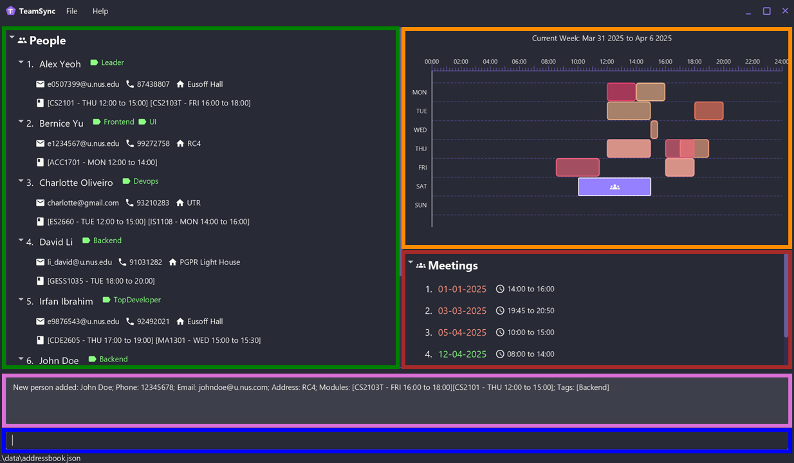
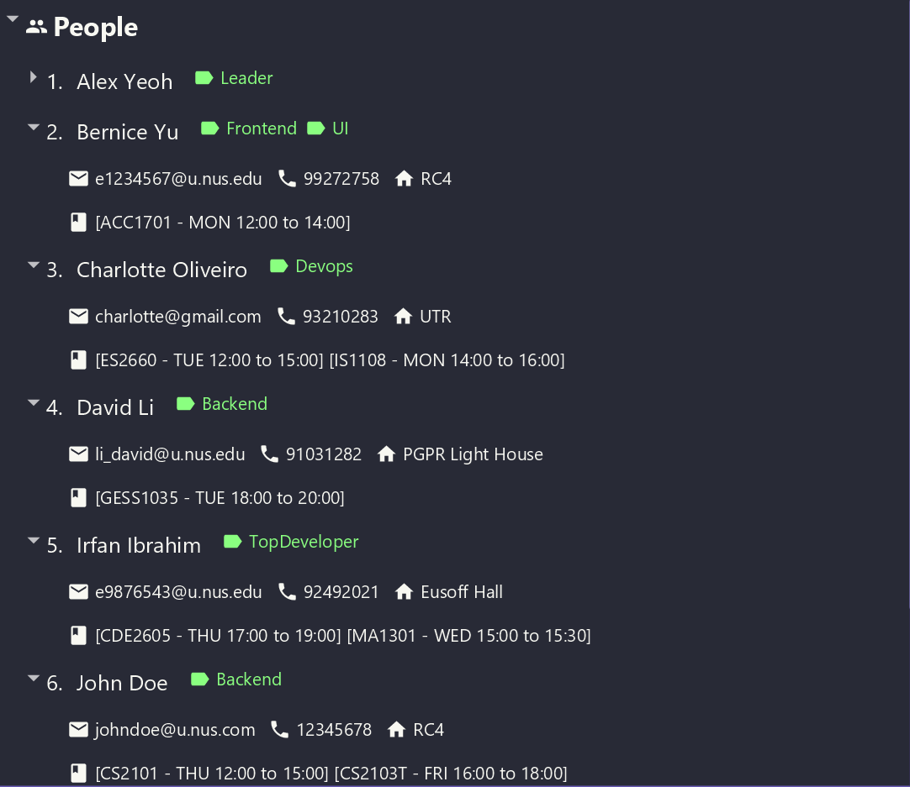
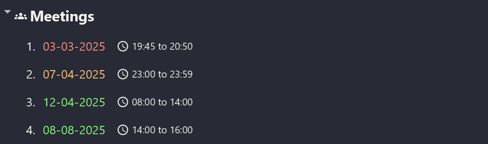
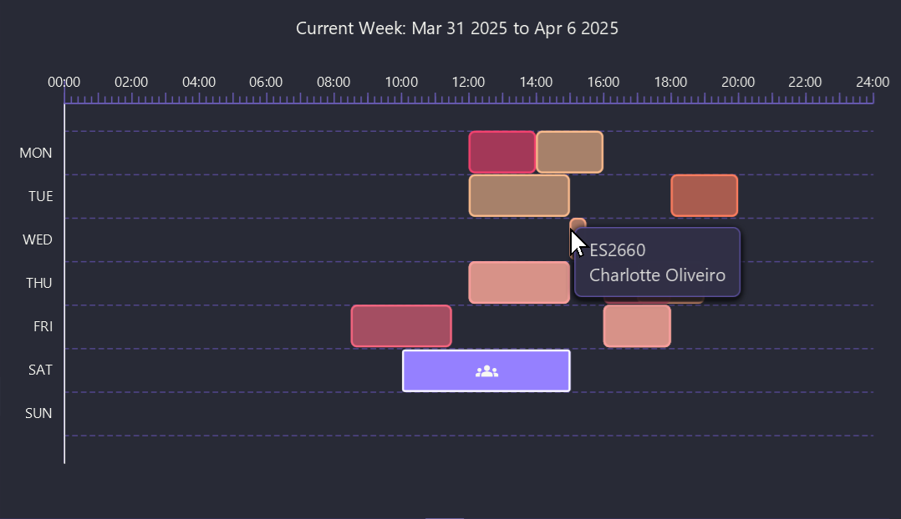
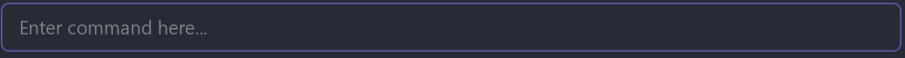
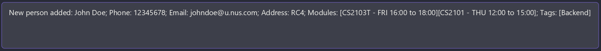
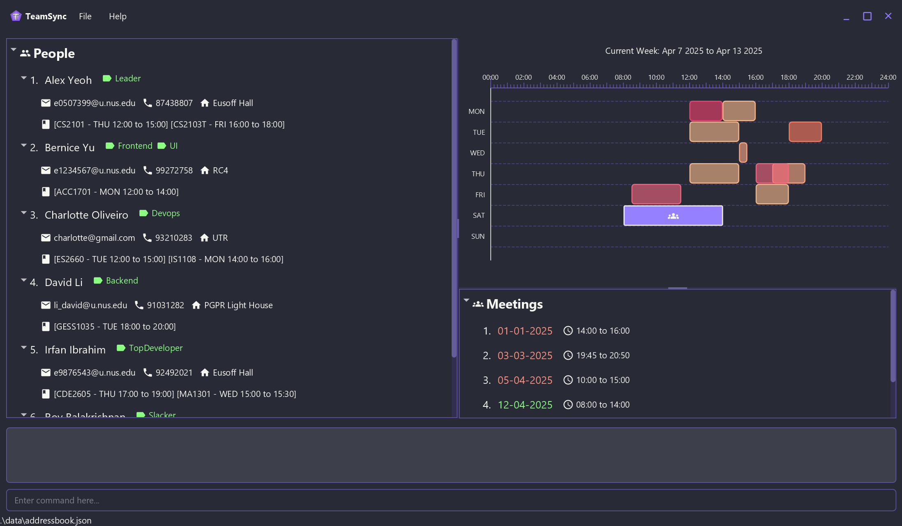
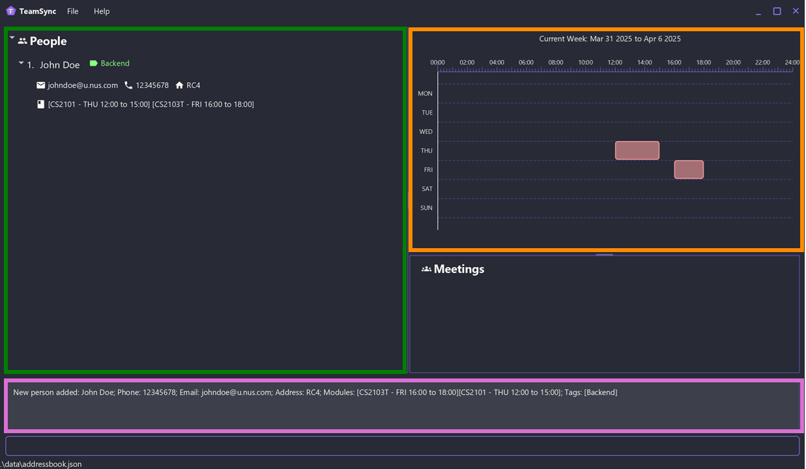
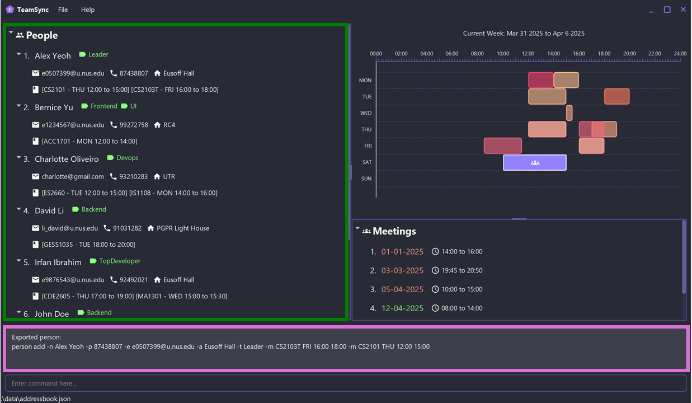
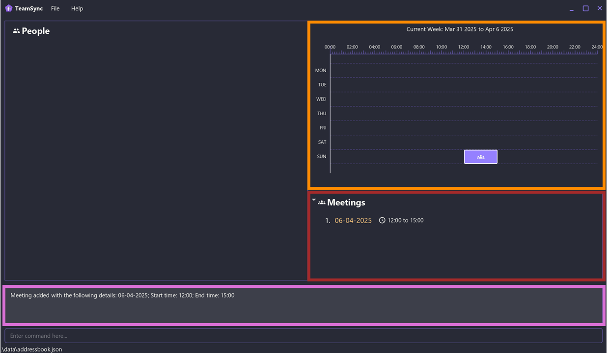

## <a href="#table-of-contents" class="head">About TeamSync</a>

TeamSync is a contact management app designed to streamline group project management **for NUS students**.

Designed with simplicity and efficiency in mind, TeamSync makes it easy to add teammates' contact details, schedule meetings, and stay organized. It combines the intuitive visuals of a Graphical User Interface ([GUI](#graphical-user-interface)) with the speed and precision of a Command Line Interface ([CLI](#command-line-interface)). Built-in validation checks help prevent errors, ensuring a seamless experience.

Whether you are new to [CLI](#command-line-interface) applications or are an experienced user, TeamSync enables you to work faster than any [GUI](#graphical-user-interface)-only app — so you can focus on what truly matters.

---

## <a href="#table-of-contents" class="head">How to Use This Guide</a>

This User Guide is designed to help you get the most out of TeamSync. Here's how to navigate it effectively:

1. **Quick Start** (For New Users)
   - If you're new to TeamSync, start with the [Quick Start](#quick-start) section.
   - This section provides step-by-step instructions to get you up and running quickly.

2. **Command Reference** (For All Users)
   - The [Commands](#commands) section contains detailed information about all available commands.
   - Commands are organized into categories:
     - [Teammate Commands](#teammate-commands)
     - [Module Commands](#module-commands)
     - [Meeting Commands](#meeting-commands)
     - [General Commands](#general-commands)

3. **Command Summary** (For Quick Reference)
   - The [Command Summary](#command-summary) section provides a quick overview of all commands.
   - Use this section as a quick reference once you're familiar with the commands.

4. **Additional Resources**
   - [FAQ](#faq): Answers to common questions
   - [Troubleshooting](#troubleshooting): Solutions to common issues
   - [Glossary](#glossary): Definitions of key terms

:bulb: **Tip**  
You can click on any of the headers in this User Guide to be linked to the [Table of Contents](#table-of-contents).

### <a href="#table-of-contents" class="head">Understanding Callout Boxes</a>

Throughout this guide, you'll encounter different types of callout boxes that provide important information:

:information_source: **Note Box**  
Provides additional information or clarifications about a feature or command. Look for these when you need more details about how something works.

:bulb: **Tip Box**  
Offers helpful tips and best practices. These can help you use TeamSync more effectively.

:exclamation: **Warning Box**  
Highlights important warnings or potential issues. Pay special attention to these to avoid problems.

:warning: **Danger Box**  
Indicates critical warnings or large-scale irreversible changes. Always read these carefully before proceeding.

---

## <a href="#table-of-contents" class="head">Table of Contents</a>

- [About TeamSync](#about-teamsync)
- [How to Use This Guide](#how-to-use-this-guide)
  - [Understanding Callout Boxes](#understanding-callout-boxes)
- [Table of Contents](#table-of-contents)
- [Features](#features)
  - [Smart Data Validation](#smart-data-validation)
  - [Effortless Team Management](#effortless-team-management)
    - [Teammate View](#teammate-view)
    - [Meeting View](#meeting-view)
    - [Timetable View](#timetable-view)
    - [Input Box](#input-box)
    - [Output Box](#output-box)
- [Quick Start](#quick-start)
- [Commands](#commands)
  - [Teammate Commands](#teammate-commands)
    - [Adding a new teammate](#adding-a-new-teammate-person-add)
    - [Editing a teammate](#editing-a-teammate--person-edit)
    - [Deleting a teammate](#deleting-a-teammate--person-delete)
    - [Searching for a teammate](#searching-for-a-teammate-person-find)
    - [Listing all teammates](#listing-all-teammates-person-list)
    - [Exporting a teammate](#exporting-a-teammate-person-export)
  - [Module Commands](#module-commands)
    - [Adding a module for a teammate](#adding-a-module-for-a-teammate-module-add)
    - [Deleting a module from a teammate](#deleting-a-module-from-a-teammate--module-delete)
  - [Meeting Commands](#meeting-commands)
    - [Adding a meeting](#adding-a-meeting-meeting-add)
    - [Deleting a meeting](#deleting-a-meeting-meeting-delete)
  - [General Commands](#general-commands)
    - [Viewing help](#viewing-help--help)
    - [Changing the week displayed](#changing-the-week-displayed-showdate)
    - [Clearing all data](#clearing-all-data--clear)
    - [Exiting TeamSync](#exiting-teamsync--exit)
- [Saving the Data](#saving-the-data)
  - [Editing the Data File](#editing-the-data-file)
- [Command Summary](#command-summary)
  - [Teammate Commands](#teammate-commands-1)
  - [Module Commands](#module-commands-1)
  - [Meeting Commands](#meeting-commands-1)
  - [General Commands](#general-commands-1)
- [Troubleshooting](#troubleshooting)
- [FAQ](#faq)
- [Glossary](#glossary)

---

## <a href="#table-of-contents" class="head">Features</a>

TeamSync allows you to manage your group projects easily by:

1. quickly [**adding, editing and deleting**](#teammate-commands) the contact details of your teammates
2. [**managing**](#module-commands) each teammate's modules and time commitments
3. [**scheduling**](#meeting-commands) meetings
4. [**visualising**](#effortless-team-management) your team's contact details and schedules

### <a href="#table-of-contents" class="head">Smart Data Validation</a>

TeamSync automatically validates your data to catch errors as early as possible, saving you time and ensuring accuracy.

With built-in checks, TeamSync guarantees that:
1. contacts are not [duplicated](#duplicate-teammate)
2. each teammate's modules are free of [duplicates](#duplicate-module) and [timing conflicts](#overlapping-module)
3. meetings are [unique](#duplicate-meeting) and scheduled without [overlaps](#overlapping-meeting)

### <a href="#table-of-contents" class="head">Effortless Team Management</a>

TeamSync provides an intuitive and user-friendly [GUI](#graphical-user-interface) that simplifies managing your team’s schedules and contact details. With clear colour coding and a comprehensive timetable view, you are able to visualise everyone's availability at a glance, helping you coordinate meetings easily.

TeamSync's [GUI](#graphical-user-interface) consists of a:
1. <a href="#teammate-view" style="color : green; font-weight: bold;">Teammate View</a>
1. <a href="#meeting-view" style="color : brown; font-weight: bold;">Meeting View</a>
1. <a href="#timetable-view" style="color : darkorange; font-weight: bold;">Timetable View</a>
1. <a href="#input-box" style="color : blue; font-weight: bold;">Input Box</a>
1. <a href="#output-box" style="color : orchid; font-weight: bold;">Output Box</a>

#### <a href="#table-of-contents" class="head">Teammate View</a>

The teammate view displays the contact details and modules of all your teammates. The contacts and modules are sorted alphabetically, allowing for quick reference.

:bulb: **Tip Box**  
Click on the ▶ or ▼ buttons to expand or collapse the contact details.

#### <a href="#table-of-contents" class="head">Meeting View</a>

The meeting view displays all your meetings in chronological order, along with their scheduled times.

To help you quickly identify them, meetings are colour-coded as follows:
* Red — Meetings that occurred before today
* Yellow — Meetings happening today
* Green — Meetings scheduled for future dates

#### <a href="#table-of-contents" class="head">Timetable View</a>

The timetable view displays a consolidated overview of your teammates' module timings and scheduled meetings, helping you track your team's commitments. Each teammate is represented by a unique colour for swift identification.

:information_source: **Note**  

* Hover over any box for a few seconds to see the teammate’s name and [module code](#module-code).

*  indicates a scheduled meeting.

#### <a href="#table-of-contents" class="head">Input Box</a>

Use the input box to type your commands for TeamSync to execute.

#### <a href="#table-of-contents" class="head">Output Box</a>

The output box displays the results from executing commands in TeamSync.

---

## <a href="#table-of-contents" class="head">Quick Start</a>

1. Ensure you have Java `17` or above installed on your computer. 
   Guide for [Windows users](https://se-education.org/guides/tutorials/javaInstallationWindows.html), [Mac Users](https://se-education.org/guides/tutorials/javaInstallationMac.html), [Linux users](https://se-education.org/guides/tutorials/javaInstallationLinux.html).

1. Download the latest `.jar` file from [here](https://github.com/AY2425S2-CS2103T-F10-1/tp/releases).

1. Copy the file to the folder you want to use as the [home folder](#home-folder) for TeamSync.

1. Open the command prompt (or terminal). 
   For **Windows**:
   Open the Command Prompt (you can find it by searching "cmd" in the Start menu).
   
   For **Mac**:
   Open the Terminal app (you can find it in Applications > Utilities).
   
   For **Linux**:
   Open the Terminal app (you can find it in Applications).

1. Type cd followed by the folder path of where you saved `teamsync.jar`, then press Enter. 
   **Example**: `cd C:\Users\Downloads`

1. Type `java -jar teamsync.jar` and press Enter. TeamSync should open in a few seconds.

   You should see the app populated with some sample data, like in the image below:
   

1. You can use TeamSync by typing a command in the <a href="#input-box" style="color : blue; font-weight: bold;">input box</a> and pressing Enter to execute it. 
   **Example**: Typing `help` and pressing Enter will open the help window.

1. Refer to the [Commands](#commands) section below for details of each command.

---

## <a href="#table-of-contents" class="head">Commands</a>

TeamSync provides you with 4 types of commands:
* [Teammate Commands](#teammate-commands)
* [Module Commands](#module-commands)
* [Meeting Commands](#meeting-commands)
* [General Commands](#general-commands)

A command consists of a command group (with the exception of general commands), command word, and zero or more parameters.

**Example**: <code style="color : red; font-weight: bold;">meeting</code> <code style="color : olivedrab; font-weight: bold;">add</code> <code style="color : darkblue; font-weight: bold;">15-02-2024 14:00 15:00</code>

:information_source: **Note**

* For each command, the correct syntax is specified under "Format".

* Commands are case-insensitive.

* Words in `UPPER_CASE` are the parameters to be supplied by the user.

* Items in square brackets are optional.

* Items with `…` after them can be used multiple times **including zero times**.

* Extraneous parameters for commands that do not take in parameters (such as `help`, `person list`, `exit` and `clear`) will be ignored.

:exclamation: **Warning**  
If you are using a PDF version of this document, be careful when copying and pasting commands that span multiple lines as **whitespaces may be omitted** when copied over to TeamSync.

---

### <a href="#table-of-contents" class="head">Teammate Commands</a>

#### <a href="#table-of-contents" class="head">Adding a new teammate: `person add`</a>

Adds a teammate to TeamSync.

**Format**: `person add -n NAME -p PHONE_NUMBER -e EMAIL -a ADDRESS [-t TAG]… [-m MODULE]…`

:information_source: **Note**

* Names should only contain alphanumeric characters, spaces, and the following special characters (`'`,`/` and `-`).

* Phone numbers should only contain numbers, and it should be at least 3 digits long.

* Emails should be of the format local-part@domain.

* Tags should only contain alphanumeric characters.

* Avoid using [command line flag patterns](#command-line-flag-patterns) like `-e` for names and addresses. Using them _might_ cause an error. 
  **Example**: `Harper-Emily` is valid, but `John -E Doe` is not

* See [adding a module for a teammate](#adding-a-module-for-a-teammate-module-add) for more information on the format for module details.

* Unable to add a teammate? TeamSync does not allow you to add [duplicate teammates](#duplicate-teammate).

:bulb: **Tip**  
A teammate can have any number of tags and modules (including 0).

**Example**: `person add -n John Doe -p 12345678 -e johndoe@u.nus.edu -a RC4 -t Backend -m CS2101 Thu 12:00 15:00 -m CS2103T Fri 16:00 18:00`

Adds a person with the following information to TeamSync: 
**Name**: `John Doe` 
**Phone number**: `12345678` 
**Email** `johndoe@u.nus.com` 
**Address**: `RC4` 
**Tags**: `Backend` 
**Modules**: `CS2101` on Thursdays from 12:00 to 15:00, `CS2103T` on Fridays from 16:00 to 18:00

This is the result of running the above command after [clearing all data](#clearing-all-data--clear). The contact details of `John Doe` are added to the <a href="#teammate-view" style="color : green; font-weight: bold;">teammate view</a>, his module timings are reflected in the <a href="#timetable-view" style="color : darkorange; font-weight: bold;">timetable view</a> and a success message is displayed in the <a href="#output-box" style="color : orchid; font-weight: bold;">output box</a>.

#### <a href="#table-of-contents" class="head">Editing a teammate : `person edit`</a>

Edits an existing teammate in TeamSync.

**Format**: `person edit INDEX [-n NAME] [-p PHONE] [-e EMAIL] [-a ADDRESS] [-t TAG]…`

:information_source: **Note**

* Edits the teammate at the specified [`INDEX`](#index), as shown in the <a href="#teammate-view" style="color : green; font-weight: bold;">teammate view</a>.

* At least one of the optional fields must be provided.

* Existing values will be updated to the input values.

* You can remove all of a teammate's tags by typing `-t ` without specifying any tags after it.

* See [adding a new teammate](#adding-a-new-teammate-person-add) for more information on the format for contact details.

:exclamation: **Warning**  

* When editing tags, **all the existing tags of the teammate will be removed**!
* When editing a teammate's name, the teammate's position might shift in the <a href="#teammate-view" style="color : green; font-weight: bold;">teammate view</a>. This is normal, as contacts are sorted alphabetically.

:bulb: **Tip**  

Trying to add or delete a module for a teammate? Use [`module add`](#adding-a-module-for-a-teammate-module-add) or [`module delete`](#deleting-a-module-from-a-teammate--module-delete) instead!

**Example**: `person edit 1 -p 87654321 -e newmail@u.nus.com -t`

Edits the information of the first teammate, as shown in the <a href="#teammate-view" style="color : green; font-weight: bold;">teammate view</a>: 
**Phone number**: Changed to `87654321` 
**Email**: Changed to `newmail@u.nus.com` 
**Tags**: All tags are removed

#### <a href="#table-of-contents" class="head">Deleting a teammate : `person delete`</a>

Deletes the specified teammate from TeamSync.

**Format**: `person delete INDEX`

:information_source: **Note**

Deletes the teammate at the specified [`INDEX`](#index), as shown in the <a href="#teammate-view" style="color : green; font-weight: bold;">teammate view</a>.

**Example**: `person delete 1`

Deletes the first teammate, as shown in the <a href="#teammate-view" style="color : green; font-weight: bold;">teammate view</a>.

:exclamation: **Warning**  
Deleting a teammate is **irreversible**!

#### <a href="#table-of-contents" class="head">Searching for a teammate: `person find`</a>

Finds teammates in TeamSync whose names contain any of the specified `KEYWORDS`.

**Format**: `person find KEYWORD [MORE_KEYWORDS]…`

:information_source: **Note**

* The search is case-insensitive. 
  **Example**: `hans` will match `Hans`

* The order of the `KEYWORDS` does not matter. 
  **Example**: `Hans Bo` will match `Bo Hans`

* Only the name is searched. 

* Only full words will be matched. 
  **Example**: `Han` will not match `Hans`

* Teammates matching at least one `KEYWORD` will be returned. 
  **Example**: `Hans Bo` will return `Hans Gruber`, `Bo Yang`

**Example**: `person find alex david`

Displays the teammates `Alex Yeoh` and `David Li`.

#### <a href="#table-of-contents" class="head">Listing all teammates: `person list`</a>

Lists all teammates in TeamSync.

**Format**: `person list`

**Example**: `person list`

:bulb: **Tip**  
Use `person list` after `find` to exit the filtered view and display all your teammates' information.

#### <a href="#table-of-contents" class="head">Exporting a teammate: `person export`</a>

Exports a teammate in TeamSync as text.

**Format**: `person export INDEX`

:information_source: **Note**

* Exports the teammate at the specified [`INDEX`](#index), as shown in the <a href="#teammate-view" style="color : green; font-weight: bold;">teammate view</a>.

* The exported text can be executed in a different instance of TeamSync as a command to recreate a teammate with the same information.

**Example**: `person export 1`

Exports the first teammate, as shown in the <a href="#teammate-view" style="color : green; font-weight: bold;">teammate view</a>.

This is the result of running the above command on the following data. The contact details of the first teammate in the <a href="#teammate-view" style="color : green; font-weight: bold;">teammate view</a>, `Alex Yeoh` is exported as text to the <a href="#output-box" style="color : orchid; font-weight: bold;">output box</a>.

The output `person add -n Alex Yeoh -p 87438807 -e e0507399@u.nus.edu -a Eusoff Hall -t Leader -m CS2103T FRI 16:00 18:00 -m CS2101 THU 12:00 15:00` can then be shared with your teammates, allowing them to add `Alex Yeoh` to their TeamSync app by simply pasting and executing this command.

---

### <a href="#table-of-contents" class="head">Module Commands</a>

#### <a href="#table-of-contents" class="head">Adding a module for a teammate: `module add`</a>

Adds a module to an existing teammate in TeamSync.

**Format**: `module add INDEX MODULE_CODE DAY START_TIME END_TIME`

:information_source: **Note**
* Adds a module for the teammate at the specified [`INDEX`](#index), as shown in the <a href="#teammate-view" style="color : green; font-weight: bold;">teammate view</a>.

* `MODULE_CODE` follows the NUS [module code](#module-code) format: 
  **Department tag** (2 - 4 letters) + **4-digit number** + **optional last letter** 
  **Example**: `CS2103T` and `CS2040` are both valid [module codes](#module-code), but `COMSCI123` is not

* `MODULE_CODE` is case-insensitive. 
  **Example**: Both `CS2103T` and `cs2103t` are regarded as the same [module code](#module-code)

* `DAY` is a 3-letter abbreviation of the day of week (Mon, Tue, Wed, …). It is case-insensitive.

* `START_TIME` and `END_TIME` should be in 24-hour HH:MM format. 
  **Example**: `14:00` is valid, but `1400` and `2pm` are not

* Unable to add a module? TeamSync does not allow you to add [duplicate](#duplicate-module) or [overlapping modules](#overlapping-module) to the same teammate.

**Example**: `module add 1 CS2101 Thu 12:00 15:00`

Adds the module CS2101 to the first teammate, as shown in the <a href="#teammate-view" style="color : green; font-weight: bold;">teammate view</a>.

#### <a href="#table-of-contents" class="head">Deleting a module from a teammate : `module delete`</a>

Deletes the specified module from an existing teammate in TeamSync.

**Format**: `module delete INDEX MODULE_CODE`

:information_source: **Note**

* Deletes the module from the teammate at the specified [`INDEX`](#index), as shown in the <a href="#teammate-view" style="color : green; font-weight: bold;">teammate view</a>.

* `MODULE_CODE` follows the NUS [module code](#module-code) format: 
  **Department tag** (2 - 4 letters) + **4-digit number** + **optional last letter** 
  **Example**: `CS2103T` and `CS2040` are both valid [module codes](#module-code), but `COMSCI123` is not

* `MODULE_CODE` is case-insensitive. 
  **Example**: Both `CS2103T` and `cs2103t` are regarded as the same [module code](#module-code)

* The teammate should have the specified module assigned to them.

**Example**: `module delete 1 CS2101`

Deletes the module CS2101 from the first teammate, as shown in the <a href="#teammate-view" style="color : green; font-weight: bold;">teammate view</a>.

:exclamation: **Warning**  
Deleting a module is **irreversible**!

---

### <a href="#table-of-contents" class="head">Meeting Commands</a>

#### <a href="#table-of-contents" class="head">Adding a meeting: `meeting add`</a>

Adds a meeting to TeamSync.

**Format**: `meeting add DATE START_TIME END_TIME`

:information_source: **Note**

* `DATE` should be in DD-MM[-YYYY] format. 
  **Example**: `24-02-2025` and `24-02` are both valid dates, but `24 Feb` is not

* `DATE` is assumed to be the current year if YYYY is not given.

* `START_TIME` and `END_TIME` should be in 24-hour HH:MM format. 
  **Example**: `14:00` is valid, but `1400` and `2pm` are not

* Unable to add a module? TeamSync does not allow you to add [duplicate](#duplicate-meeting) or [overlapping meetings](#overlapping-meeting).

**Example**: `meeting add 06-04-2025 12:00 15:00`

Adds a new meeting on 6 Apr 2025 from 12pm to 3pm.

This is the result of running the above command after [clearing all data](#clearing-all-data--clear). The meeting details are added to the <a href="#meeting-view" style="color : brown; font-weight: bold;">meeting view</a>, the scheduled meeting is reflected in the <a href="#timetable-view" style="color : darkorange; font-weight: bold;">timetable view</a> and a success message is displayed in the <a href="#output-box" style="color : orchid; font-weight: bold;">output box</a>.

#### <a href="#table-of-contents" class="head">Deleting a meeting: `meeting delete`</a>

Deletes the specified meeting from TeamSync.

**Format**: `meeting delete INDEX`

:information_source: **Note**  
Deletes the meeting at the specified [`INDEX`](#index), as shown in the <a href="#meeting-view" style="color : brown; font-weight: bold;">meeting view</a>.

**Example**: `meeting delete 1`

Deletes the first meeting in TeamSync, as shown in the <a href="#meeting-view" style="color : brown; font-weight: bold;">meeting View</a>.

:exclamation: **Warning**  
Deleting a meeting is **irreversible**!

---

### <a href="#table-of-contents" class="head">General Commands</a>

#### <a href="#table-of-contents" class="head">Viewing help : `help`</a>

Opens a help window displaying a summary of all the commands in TeamSync.

**Format**: `help`

**Example**: `help`

#### <a href="#table-of-contents" class="head">Changing the week displayed: `showdate`</a>

Changes the week displayed in the timetable view in TeamSync.

Format: `showdate DATE`

:information_source: **Info**

* Displays the timetable for the week containing the specified `DATE`, starting on Monday.

* `DATE` should be in DD-MM[-YYYY] format. 
  **Example**: `24-02-2025` and `24-02` are both valid dates, but `24 Feb` is not

* `DATE` is assumed to be the current year if YYYY is not given.

Example: `showdate 03-04-2025`

Displays the timetable for 31 Mar 2025 (Mon) to 6 Apr 2025 (Sun).

#### <a href="#table-of-contents" class="head">Clearing all data : `clear`</a>

Clears all teammates, modules and meetings from TeamSync.

**Format**: `clear`

**Example**: `clear`

:warning: **Danger**  
**Deletion is irreversible**! Only use this command if you are sure that all the data is no longer needed.

#### <a href="#table-of-contents" class="head">Exiting TeamSync : `exit`</a>

Exits TeamSync.

**Format**: `exit`

**Example**: `exit`

---

## <a href="#table-of-contents" class="head">Saving the Data</a>
TeamSync data is saved automatically after executing any command that changes the data. There is no need to save manually.

### <a href="#table-of-contents" class="head">Editing the Data File</a>
TeamSync data is saved as a [JSON](#json) file. Advanced users are welcome to update the data directly by editing `teamsync.json` located in the `data` subfolder of TeamSync's [home folder](#home-folder).

:warning: **Danger**  
**It is strongly recommended to make a backup of `teamsync.json` before editing it.**

If your edits to `teamsync.json` corrupts it and TeamSync is unable to load the data, **TeamSync will discard all data** and start with an empty data file at the next run.

Furthermore, **certain edits can cause TeamSync to behave in unexpected ways**.

Therefore, **edit the file only if you are confident** that you can update it correctly.

---

### <a href="#table-of-contents" class="head">Command Summary</a>

#### <a href="#table-of-contents" class="head">Teammate Commands</a>

| Action                    | Format                                                                          | Example                                                                                                  |
|---------------------------|---------------------------------------------------------------------------------|----------------------------------------------------------------------------------------------------------|
| **Add a teammate**        | `person add -n NAME -p PHONE_NUMBER -e EMAIL -a ADDRESS [-t TAG]… [-m MODULE]…` | `person add -n John Doe -p 12345678 -e johndoe@u.nus.edu -a RC4 -t Backend -m CS2101 Thu 12:00 15:00 -m CS2103T Fri 16:00 18:00` |
| **Edit a teammate**       | `person edit INDEX [-n NAME] [-p PHONE] [-e EMAIL] [-a ADDRESS] [-t TAG]…`      | `person edit 1 -p 87654321 -e newmail@u.nus.com -t`                                                       |
| **Delete a teammate**     | `person delete INDEX`                                                           | `person delete 1`                                                                                        |
| **Search for a teammate** | `person find KEYWORD [MORE_KEYWORDS]…`                                           | `person find alex david`                                                                                 |
| **List all teammates**    | `person list`                                                                   | `person list`                                                                                            |
| **Export a teammate**     | `person export INDEX`                                                           | `person export 1`                                                                                        |

#### <a href="#table-of-contents" class="head">Module Commands</a>

| Action                              | Format                                                 | Example                               |
|-------------------------------------|--------------------------------------------------------|---------------------------------------|
| **Add a module for a teammate**     | `module add INDEX MODULE_CODE DAY START_TIME END_TIME` | `module add 1 CS2101 Thu 12:00 15:00` |
| **Delete a module from a teammate** | `module delete INDEX MODULE_CODE`                      | `module delete 1 CS2101`              |

#### <a href="#table-of-contents" class="head">Meeting Commands</a>

| Action               | Format                                 | Example                              |
|----------------------|----------------------------------------|--------------------------------------|
| **Add a meeting**    | `meeting add DATE START_TIME END_TIME` | `meeting add 06-04-2025 12:00 15:00` |
| **Delete a meeting** | `meeting delete INDEX`                 | `meeting delete 1`                   |

#### <a href="#table-of-contents" class="head">General Commands</a>

| Action                        | Format          | Example               |
|-------------------------------|-----------------|-----------------------|
| **View help**                 | `help`          | `help`                |
| **Change the week displayed** | `showdate DATE` | `showdate 04-04-2025` |
| **Clear all data**            | `clear`         | `clear`               |
| **Exit TeamSync**             | `exit`          | `exit`                |

---

## <a href="#table-of-contents" class="head">Troubleshooting</a>

**1**\. **The <a href="#graphical-user-interface" style="color : black;">GUI</a> appears off-screen**  
This may occur when using multiple screens. To resolve this issue, simply delete the `preferences.json` file located in TeamSync's [home folder](#home-folder) before restarting the app.

**2**\. **Unable to run the JAR file**  
Ensure you have followed the steps outlined in the [Quick Start](#quick-start) section. In particular, double-clicking on the JAR file **might not** launch the app.

---

## <a href="#table-of-contents" class="head">FAQ</a>

**Q**: **How do I transfer my data to another computer?** 
**A**: Copy the contents of TeamSync's [home folder](#home-folder) to the other computer. You are now able to continue using TeamSync with all your existing data.

**Q**: **What are the system requirements for TeamSync?** 
**A**: TeamSync is optimised for Windows, MacOS, and Linux only. Additionally, Java `17` or above must be installed. While TeamSync might run on unsupported systems, we do not provide any assistance for these environments.

**Q**: **Why does TeamSync store past meetings?** 
**A**: We believe that there is value in storing your past meetings for archival purposes. These are highlighted in red in the <a href="#meeting-view" style="color : brown; font-weight: bold;">meeting view</a> and can be deleted at your discretion.

**Q**: **Will TeamSync be updated to support editing modules via the [`person edit`](#editing-a-teammate--person-edit) command?** 
**A**: No. This is a deliberate design decision. As modules consist of three fields — a date, start and end time — editing them through [`person edit`](#editing-a-teammate--person-edit) increases the likelihood of human error.

**Q**: **Will TeamSync be updated to prompt for confirmation before clearing all data?** 
**A**: No. The [`clear`](#clearing-all-data--clear) command is the only way to clear all data. Adding a confirmation prompt is unlikely to reduce accidental usage.

---

## <a href="#table-of-contents" class="head">Glossary</a>

| Terms                                                                     | Definition                                                                                                                                                                |
|---------------------------------------------------------------------------|---------------------------------------------------------------------------------------------------------------------------------------------------------------------------|
| **Command line flag patterns**   | A word consisting solely of a dash followed by a letter, such as `-a` and `-E`                                                                                            |
| **Command Line Interface (CLI)**     | A text-based interface that allows users to interact with the application by typing commands                                                                              |
| **Duplicate meeting**                     | Two meetings are duplicates if they have the same date, start and end time                                                                                                |
| **Duplicate module**                       | Two modules are duplicates if they have the same module code                                                                                                              |
| **Duplicate teammate**                   | Two teammates are duplicates if they have the same email address                                                                                                          |
| **Graphical User Interface (GUI)** | A graphical interface that allows users to interact with the application through visual elements                                                                          |
| **Home folder**                                 | The folder where TeamSync is stored in                                                                                                                                    |
| **Index**                                             | A **positive integer** 1, 2, 3, … shown in TeamSync that identifies a teammate or a meeting                                                                               |
| **JSON**                                               | A text-based data storage format. See [this](https://www.json.org/json-en.html) for more info.                                                                            |
| **Module**                                           | A course offered by NUS                                                                                                                                                   |
| **Module code**                                 | The unique code associated with each module in NUS. It follows the following format: **Department tag** (2 - 4 letters) + **4-digit number** + **optional last letter** |
| **Overlapping meeting**                 | Two meetings are overlapping if they are scheduled on the same date and their time intervals intersect                                                                    |
| **Overlapping module**                   | Two modules are overlapping if they are scheduled on the same day of the week and their time intervals intersect                                                          |
| **Teammate**                                       | An NUS group project teammate stored as a contact in TeamSync                                                                                                             |
| **Tag**                                                 | Optional information associated with a teammate to facilitate categorisation                                                                                              |
