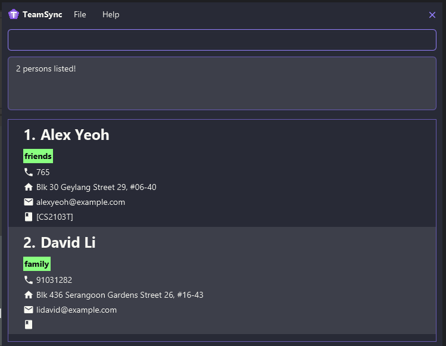
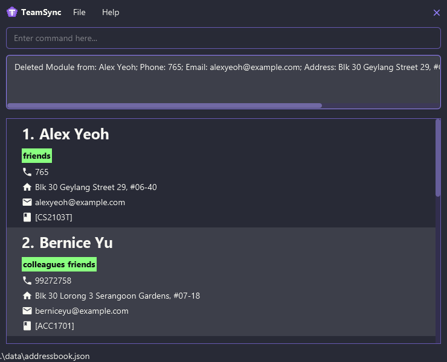
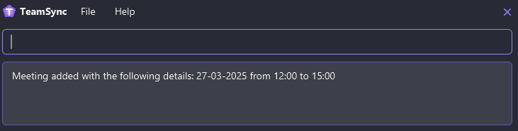
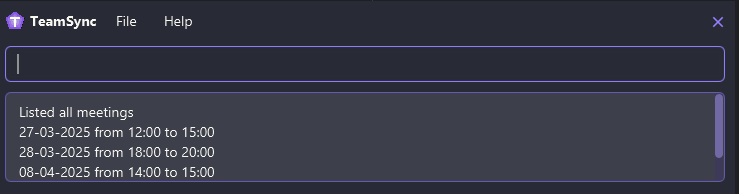
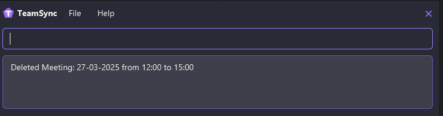

# TeamSync User Guide

TeamSync is a **desktop app for NUS students to manage their teammates' information, optimized for use via a Command Line Interface** (CLI) while still having the benefits of a Graphical User Interface (GUI). If you can type fast, TeamSync can get your contact management tasks done faster than traditional GUI apps.

* Table of Contents
{:toc}

--------------------------------------------------------------------------------------------------------------------

## Quick start

1. Ensure you have Java `17` or above installed in your Computer. 
   **Mac users:** Ensure you have the precise JDK version prescribed [here](https://se-education.org/guides/tutorials/javaInstallationMac.html).

1. Download the latest `.jar` file from [here](https://github.com/AY2425S2-CS2103T-F10-1/tp/releases).

1. Copy the file to the folder you want to use as the _home folder_ for TeamSync.

1. Open a command terminal, `cd` into the folder you put the jar file in, and use the `java -jar addressbook.jar` command to run the application. 
   A GUI similar to the below should appear in a few seconds. Note how the app contains some sample data. 
   

1. Type the command in the command box and press Enter to execute it. e.g. typing **`help`** and pressing Enter will open the help window. 
   Some example commands you can try:

   * `list` : Lists all students.

   * `add -n John Doe -p 98765432 -p johnd@example.com -a John street, block 123, #01-01` : Adds a student named `John Doe` to TeamSync.

   * `delete 3` : Deletes the 3rd student shown in the current list.

   * `clear` : Deletes all contacts.

   * `exit` : Exits the app.

1. Refer to the [Features](#features) below for details of each command.

--------------------------------------------------------------------------------------------------------------------

## Features

**:information_source: Notes about the command format:** 

* Words in `UPPER_CASE` are the parameters to be supplied by the user. 
  e.g. in `add -n NAME`, `NAME` is a parameter which can be used as `add -n John Doe`.

* Items in square brackets are optional. 
  e.g `-n NAME [-t TAG]` can be used as `-n John Doe -t friend` or as `-n John Doe`.

* Items with `…`​ after them can be used multiple times including zero times. 
  e.g. `[-t TAG]…​` can be used as ` ` (i.e. 0 times), `-t friend`, `-t friend -t family` etc.

* Parameters can be in any order. 
  e.g. if the command specifies `-n NAME -p PHONE_NUMBER`, `-p PHONE_NUMBER -n NAME` is also acceptable.

* Extraneous parameters for commands that do not take in parameters (such as `help`, `list`, `exit` and `clear`) will be ignored. 
  e.g. if the command specifies `help 123`, it will be interpreted as `help`.

* If you are using a PDF version of this document, be careful when copying and pasting commands that span multiple lines as space characters surrounding line-breaks may be omitted when copied over to the application.

### Viewing help : `help`

Shows a message explaning how to access the help page.

Format: `help`

### Adding a student: `add`

Adds a student to TeamSync.

Format: `add -n NAME -p PHONE_NUMBER -e EMAIL -a ADDRESS [-t TAG]…​`

:bulb: **Tip:**
A student can have any number of tags (including 0)

Examples:
* `add -n John Doe -p 98765432 -e johnd@example.com -a John street, block 123, #01-01`
* `add -n Betsy Crowe -t friend -e betsycrowe@example.com -a Newgate Prison -p 1234567 -t criminal`

### Listing all students : `list`

Shows a list of all students in TeamSync.

Format: `list`

### Editing a students : `edit`

Edits an existing students in TeamSync.

Format: `edit INDEX [-n NAME] [-p PHONE] [-e EMAIL] [-a ADDRESS] [-t TAG]…​`

* Edits the student at the specified `INDEX`. The index refers to the index number shown in the displayed student list. The index **must be a positive integer** 1, 2, 3, …​
* At least one of the optional fields must be provided.
* Existing values will be updated to the input values.
* When editing tags, the existing tags of the student will be removed i.e adding of tags is not cumulative.
* You can remove all the student’s tags by typing `-t ` without
    specifying any tags after it.

Examples:
*  `edit 1 -p 91234567 -e johndoe@example.com` Edits the phone number and email address of the 1st student to be `91234567` and `johndoe@example.com` respectively.
*  `edit 2 -n Betsy Crower -t ` Edits the name of the 2nd student to be `Betsy Crower` and clears all existing tags.

### Locating students by name: `find`

Finds students whose names contain any of the given keywords.

Format: `find KEYWORD [MORE_KEYWORDS]`

* The search is case-insensitive. e.g `hans` will match `Hans`
* The order of the keywords does not matter. e.g. `Hans Bo` will match `Bo Hans`
* Only the name is searched.
* Only full words will be matched e.g. `Han` will not match `Hans`
* students matching at least one keyword will be returned (i.e. `OR` search).
  e.g. `Hans Bo` will return `Hans Gruber`, `Bo Yang`

Examples:
* `find John` returns `john` and `John Doe`
* `find alex david` returns `Alex Yeoh`, `David Li` 
  

### Deleting a student : `delete`

Deletes the specified student from TeamSync.

Format: `delete INDEX`

* Deletes the student at the specified `INDEX`.
* The index refers to the index number shown in the displayed student list.
* The index **must be a positive integer** 1, 2, 3, …​

Examples:
* `list` followed by `delete 2` deletes the 2nd student in TeamSync.
* `find Betsy` followed by `delete 1` deletes the 1st student in the results of the `find` command.

### Adding a module to a student: `addmod`

Adds a module to the specified student

Format: `addmod INDEX MODULE_CODE DAY START_TIME END_TIME`

* The index refers to the index number shown in the displayed student list. The index **must be a positive integer** 1, 2, 3, …​
* The module code will follow NUS module code format (Department tag + 4-digit number + optional last letter)
* Module code is case-insensitive.  e.g. cs2103t and CS2103T will be regarded as the same module
* Module code given has to be new (Given student does not already have this module assigned)
* Day is 3-letter abbreviation of the day of week (MON, TUE, THU etc). It is case-insensitive
* Start time and End time is given in 24-hour format and in HH:MM

Examples:
* `addmod 1 cs2101 thu 12:00 15:00` assigns module CS2101 to the first student in TeamSync.
  

### Deleting a module from a student : `delmod`

Deletes the specified module from the given student in TeamSync.

Format: `delmod INDEX MODULE_CODE`

* Deletes the module from the student at the specified `INDEX`.
* The index refers to the index number shown in the displayed student list.
* The index **must be a positive integer** 1, 2, 3, …​
* Module code has to be an existing module assigned to the specified student.
* Module code is case-insensitive. e.g cs2103t will match CS2103T

Examples:
* `delmod 1 cs2101` deletes the module CS2101 from the 1st student in TeamSync.
  

### Add a meeting for the team: `meeting`

Creates a meeting with the specified date, start and end time

Format: `meeting DATE START_TIME END_TIME`

* DATE is in DD-MM-YYYY format
* Start time and End time is given in 24-hour format and in HH:MM

Examples:
* `meeting 27-03-2025 12:00 15:00` creates a new meeting on 27th March 2025 from 12pm to 3pm.
  

### Listing all meetings : `listmeetings`

Shows a list of all meetings in TeamSync.

Format: `listmeetings`

Examples:
* `listmeetings` lists all existing meetings in TeamSync.
  

### Delete an existing meeting: `delmeeting`

Deletes the meeting identified by the index number used in the displayed meeting list

Format: `delmeeting INDEX`

* Deletes the meeting at the specified `INDEX`.
* The index refers to the index number shown in the displayed meeting list.
* The index **must be a positive integer** 1, 2, 3, …​

Examples:
* `listmeetings` followed by `delete 1` deletes the 1st meeting in TeamSync.

Examples:
* `delmeeting 1` deletes the first meeting in TeamSync
  

### Clearing all entries : `clear`

Clears all entries from TeamSync.

Format: `clear`

### Exiting the program : `exit`

Exits the program.

Format: `exit`

### Saving the data

AddressBook data are saved in the hard disk automatically after any command that changes the data. There is no need to save manually.

### Editing the data file

AddressBook data are saved automatically as a JSON file `[JAR file location]/dat-a addressbook.json`. Advanced users are welcome to update data directly by editing that data file.

:exclamation: **Caution:**
If your changes to the data file makes its format invalid, AddressBook will discard all data and start with an empty data file at the next run. Hence, it is recommended to take a backup of the file before editing it. 
Furthermore, certain edits can cause the AddressBook to behave in unexpected ways (e.g., if a value entered is outside of the acceptable range). Therefore, edit the data file only if you are confident that you can update it correctly.

### Archiving data files `[coming in v2.0]`

_Details coming soon ..._

--------------------------------------------------------------------------------------------------------------------

## FAQ

**Q**: How do I transfer my data to another Computer? 
**A**: Install the app in the other computer and overwrite the empty data file it creates with the file that contains the data of your previous AddressBook home folder.

--------------------------------------------------------------------------------------------------------------------

## Known issues

1. **When using multiple screens**, if you move the application to a secondary screen, and later switch to using only the primary screen, the GUI will open off-screen. The remedy is to delete the `preferences.json` file created by the application before running the application again.
2. **If you minimize the Help Window** and then run the `help` command (or use the `Help` menu, or the keyboard shortcut `F1`) again, the original Help Window will remain minimized, and no new Help Window will appear. The remedy is to manually restore the minimized Help Window.

--------------------------------------------------------------------------------------------------------------------

## Command summary

Action | Format, Examples
--------|------------------
**Add** | `add -n NAME -p PHONE_NUMBER -e EMAIL -a ADDRESS [-t TAG]…​`   e.g., `add -n James Ho -p 22224444 -e jamesho@example.com -a 123, Clementi Rd, 1234665 -t friend -t colleague`
**Edit** | `edit INDEX [-n NAME] [-p PHONE_NUMBER] [-e EMAIL] [-a ADDRESS] [-t TAG]…​`  e.g.,`edit 2 -n James Lee -e jameslee@example.com`
**List** | `list`
**Find** | `find KEYWORD [MORE_KEYWORDS]`  e.g., `find James Jake`
**Delete** | `delete INDEX`  e.g., `delete 3`
**AddModule** | `addmod INDEX MODULE_CODE DAY START_TIME END_TIME`   e.g., `addmod 1 cs2101 thu 12:00 15:00`
**DeleteModule** | `delmod INDEX MODULE_CODE`   e.g., `delmod 1 cs2101`
**AddMeeting** | `meeting DATE START_TIME END_TIME`   e.g., `meeting 27-03-2025 12:00 15:00`
**ListMeetings** | `listmeetings`
**DeleteMeeting** | `delmeeting INDEX`   e.g., `delmeeting 1`
**Clear** | `clear`
**Help** | `help`
