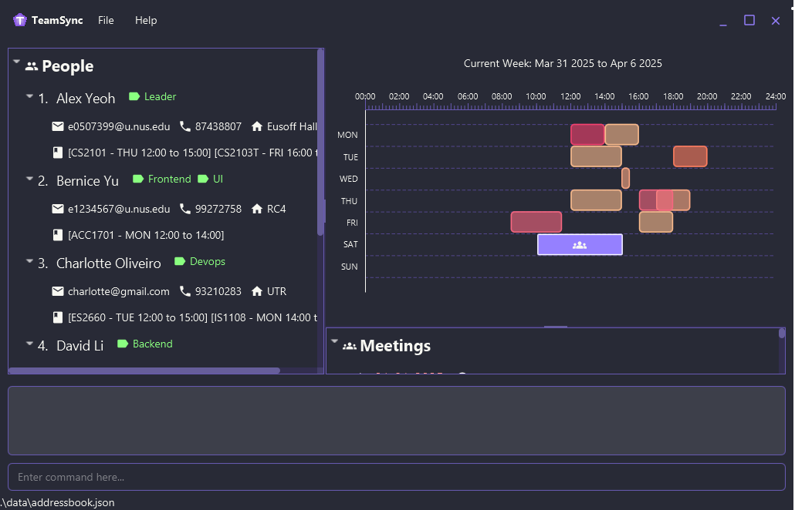

TeamSync is a contact management app designed to streamline group project management, **built by National University of Singapore (NUS) students, for NUS students**.

Designed with simplicity and efficiency in mind, TeamSync makes it easy to add teammates' contact details, schedule meetings, and stay organized. It combines the intuitive visuals of a Graphical User Interface (GUI) with the speed and precision of a Command Line Interface (CLI). Built-in validation checks help prevent errors, ensuring a seamless experience.

* If you are interested in using TeamSync, head over to the [_Quick Start_ section of the **User Guide**](UserGuide.html#quick-start).
* If you are interested about developing TeamSync, the [**Developer Guide**](DeveloperGuide.html) is a good place to start.

**Acknowledgements**

* Libraries used: [JavaFX](https://openjfx.io/), [Jackson](https://github.com/FasterXML/jackson), [JUnit5](https://github.com/junit-team/junit5)
* TeamSync is built on [AddressBook Level-3](https://se-education.org/addressbook-level3/)